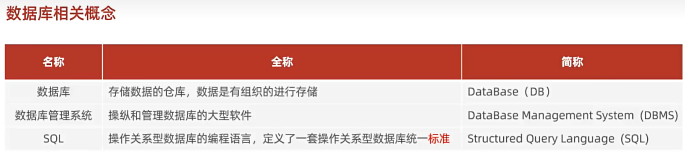
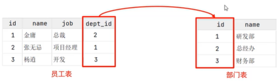
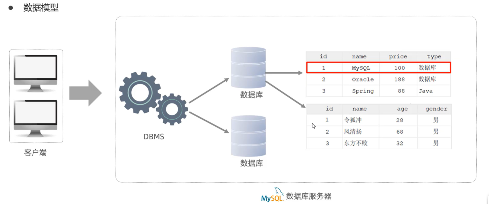

# MySQL 概述

## 数据库相关概念

## 关系型数据库（RDBMS）
概念：建立在**关系模型**基础上，由多张**相互连接**的**二维表**组成的数据库

> #### 问题——什么是二维表
> 形如下面这样的表
> 
> Tips：在后面将二维表简称为**表**

> #### 问题——什么是表的相互连接
> 表中的某些项可以用来访问另一张表的内容，例如：
> 

特点：
- 使用表存储数据，**格式统一，便于维护**
- 使用 SQL 语言操作，**标准统一，使用方便**

## MySQL 数据模型

- 在 MySQL 数据库服务器中有一个数据库管理系统
- 一个数据库管理系统可以管理多个数据库
- 每个数据库可以创建多张表