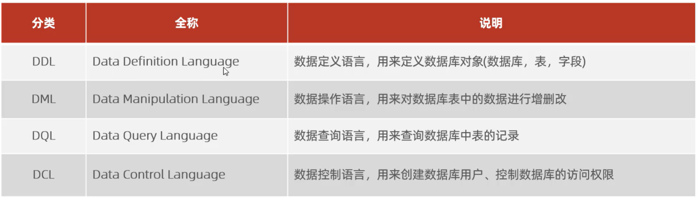
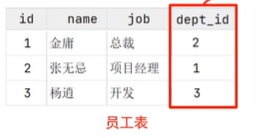
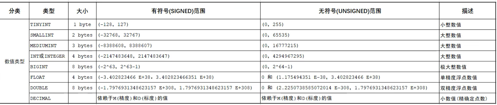
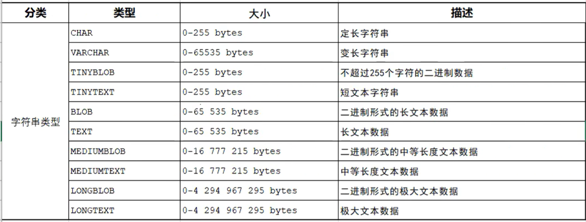
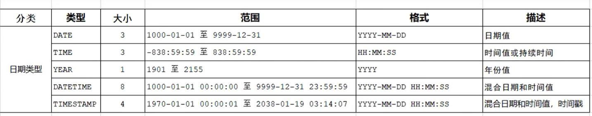
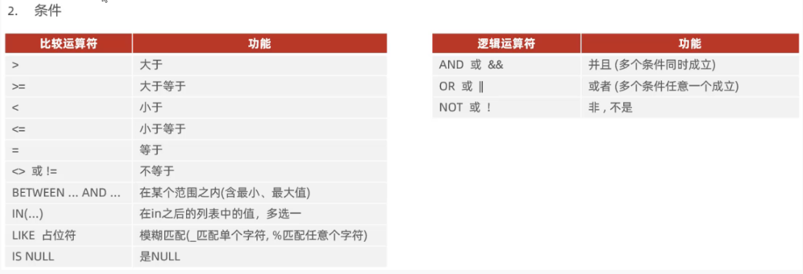
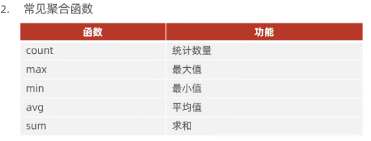
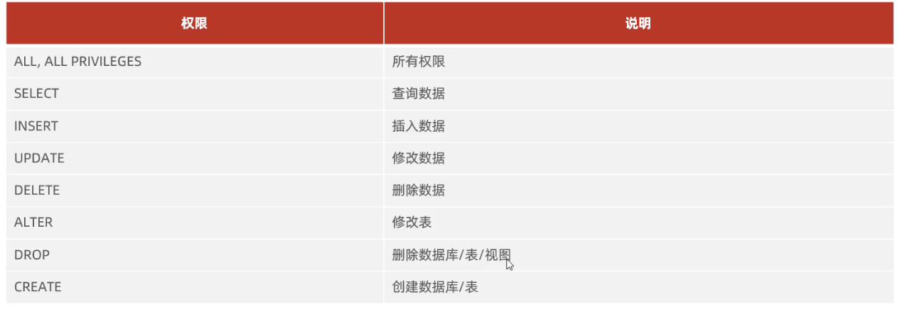

# SQL

## SQL 通用语法
1. SQL 语句可以**单行/多行**书写，以**分号**结尾
2. SQL 语句可以使用**空格/缩进**来增强语句可读性
3. MySQL 数据库的 SQL 语句**不区分大小写**，关键字建议用**大写**
4. 注释：
   - 单行：**-- 注释内容** 或 **# 注释内容**
   - 多行注释：/\*注释内容\*/

## SQL 分类
SQL 可以分为以下几类


## DDL 语句

### 数据库操作
```sql
# 查询所有数据库
SHOW DATABASES;

# 查询当前数据库
SELECT DATABASE();

# 创建数据库
CREATE DATABASE [IF NOT EXISTS] 数据库名字 [DEFAULT CHARSET 字符集] [COLLATE 排序规则];

# 删除数据库
DROP DATABASE [IF EXISTS] 数据库名字;

# 使用数据库
USE 数据库名字;
```

> #### Tips
> 1. 在创建数据库时，注意加上 IF NOT EXISTS
> 2. 在删除数据库时，注意加上 IF EXISTS
> 3. 在创建数据库时，如果要为数据库设置字符集，尤其是要用 utf8 字符集，注意加上 DEFAULT CHARSET utf8mb4

### 表操作

#### 查询表
```sql
# 查询当前数据库中的所有表
SHOW TABLES;

# 查询表结构
DESC 表的名字;

# 查询指定表的建表语句
SHOW CREATE TABLE 表的名字;
```

#### 创建表
```sql
CREATE TABLE 表的名字 (
  字段1 字段1的类型 [COMMENT 字段1的注释]
  字段2 字段2的类型 [COMMENT 字段2的注释]
  ...
  字段n 字段n的类型 [COMMENT 字段n的注释]
)[COMMENT 表注释]
```

> #### Tips
> 表名是**大小写不敏感**的

- 字段：如下图所示
  
  像 id, name, job 之类的就是字段
- 类型：例如 INT, VARCHAR(n)等
- COMMENT：注释，用来说明该字段的含义

> #### 关于类型的拓展
> 类型大体分为**数值**类型，**字符串**类型和**日期时间**类型
> ##### 数值类型
> 
>
> ##### 字符串类型
> 
> 
> **定长**字符串：对于 CHAR(10) 字符串，即使该字符串的长度小于 10 个字符，该字符串**还是会占用 10 个字符的空间**。性能**高**
>
> **变长**字符串：对于 VARCHAR(10) 字符串，如果字符串的长度小于10个字符，该字符串就**只会占用使用的空间**。性能**低**
> 
> Tips：这两种字符串都不允许实际长度大于规定长度
> 
> ##### 日期时间类型
> 

#### 修改表（字段操作）

##### 添加字段
```sql
# 添加字段
ALTER TABLE 表名 ADD 字段名 字段类型 [COMMENT 注释] [约束];
```

##### 修改字段
```sql
# 修改数据类型
ALTER TABLE 表名 MODIFY 字段名 新的数据类型;

# 修改字段名和数据类型
ALTER TABLE 表名 CHANGE 旧字段名 新字段名 新的数据类型 [COMMENT 注释] [约束];
```

##### 删除字段
```sql
# 删除字段
ALTER TABLE 表的名字 DROP 字段的名字;
```

##### 修改表的名字
```sql
# 修改表名
ALTER TABLE 表名 RENAME TO 新的表名
```

##### 删除表
```sql
# 删除表
DROP TABLE [IF EXISTS] 表的名字;

# 删除指定表，并重新创建该表
TRUNCATE TABLE 表的名字;
```

## DML 语句

### 添加数据
```sql
# 给指定字段添加数据
INSERT INTO 表名 (字段名1, 字段名2,...) VALUES (值1, 值2, ...);

# 给全部字段添加数据
INSERT INTO 表名 VALUES (值1, 值2, ...);

# 批量添加数据
INSERT INTO 表名 (字段名1, 字段名2,...) VALUES (值1, 值2, ...), (值1, 值2, ...)...;
INSERT INTO 表名 VALUES (值1, 值2, ...), (值1, 值2, ...)...;
```

### 修改数据（更新数据）
```sql
# 修改数据
UPDATE 表名 SET 字段名1 = 值1, 字段名2 = 值2, ... [WHERE 条件]

# 注意：条件可以有也可以没有，如果没有条件则默认修改整张表的数据
```

### 删除数据
```sql
# 删除数据
DELETE FROM 表名 [WHERE 条件]

# 注意
# DELETE 语句的条件可以有，也可以没有，如果没有条件，则会删除整张表的所有数据
# DELETE 语句不可以删除某一个字段的值
```

> #### Tips
> 如果要删除某一个字段的值，可以使用 UPDATE 将那个字段的值设置为**NULL**

## DQL 语句
DQL 的英文全称是 Data Query Language（数据查询语言），用来**查询数据库中表的记录**

查询关键字：**SELECT**

### DQL 语法
DQL 语句包括：
- SELECT 字段列表
- FROM 表名列表
- WHERE 条件列表
- GROUP BY 分组字段列表
- HAVING 分组后条件列表
- ORDER BY 排序字段列表
- LIMIT 分页参数

同时这个就是 DQL 语句编写的顺序（**不是执行顺序**）
### DQL 基本查询
```sql
# 查询多个字段
SELECT 字段1,字段2,... FROM 表名
# 查询所有字段（整张表）
SELECT * FROM 表名
# 给字段设置别名
SELECT 字段1 [AS 别名1], 字段2 [AS 别名2], ... FROM 表名;
# 去除重复记录
SELECT DISTINCT 字段1,字段2,... FROM 表名;
```

> #### Tips
> DISTINCT 可以用于在统计时（COUNT）去除重复记录

> #### Tips
> 在设置别名时，**AS** 关键字是**可以省略**的

### DQL 条件查询


```sql
# 条件查询
# 字段列表：字段1,字段2,...
# 条件列表：条件1,条件2,...
SELECT 字段列表 FROM 表名 WHERE 条件列表;
```

> #### 例子——LIKE 占位符
> ```sql
> 例子 1：查找名字（name）为两个字的员工
> SELECT * FROM employees WHERE name like '__';
>
> 例子 2：查找身份证号（idcard）最后一位为 'X' 的员工
> SELECT * FROM employees WHERE idcard like '%X';
> ```

### 聚合函数
聚合函数将**一列数据**作为一个整体，进行**纵向计算**。例如计算所有员工的年龄平均值/最小值/最大值


```sql
SELECT 聚合函数(字段列表) FROM 表名;
```

> #### Tips
> NULL 值**不参与**所有聚合函数运算
>
> 例如使用：SELECT COUNT(ID) FROM USERS; 时，只会记录 ID 字段值不为 NULL 的数量

### 分组查询
```sql
SELECT 字段列表 FROM 表名 [WHERE 条件] GROUP BY 分组字段名 [HAVING 分组后的过滤条件]
```

> #### Tips
> 分组字段可以是**多个字段的组合**，如果是多个字段的组合，那么分组也是按照**字段组合**进行的。且多个字段用**逗号**隔开

> #### Tips
> WHERE 和 HAVING 的区别
> - 执行时机不同：WHERE 是**分组之前**进行过滤，不满足 WHERE 条件则不参加分组；而 HAVING 是**分组之后**对结果进行过滤
> - 判断条件不同：WHERE **不能对聚合函数进行判断**，而 HAVING **可以**

> #### Tips
> 执行顺序：WHERE > 聚合函数 > HAVING
> 分组之后，查询的字段一般为**聚合函数和分组字段**，查询其他字段无任何意义

> #### 例子
> 在 emp 中查询年龄（age）小于 45 的员工，并根据工作地址（workaddress）分组，获取员工数量大于等于 3 的工作地址
> ```sql
>  SELECT workaddress, count(*) FROM emp WHERE age < 45 GROUP BY workaddress HAVING count(*) >= 3;
> ```

### 排序查询
```sql
SELECT 字段列表 FROM 表名 ORDER BY 字段1 排序方式1, 字段2 排序方式2, ...;
```

两种排序方式
- ASC：升序（默认值）
- DESC：降序

> #### Tips
> 如果是多个字段排序，当第一个字段值**相同时**，才会根据第二个字段进行排序

### 分页查询
```sql
SELECT 字段列表 FROM 表名 LIMIT 起始索引, 查询记录数;
```

> #### Tips
> - 起始索引从 **0** 开始，起始索引 = (查询页码 - 1) * 每页显示记录数
> - 分页查询是数据库的**方言**，不同数据库的实现不同
> - 如果查询的是**第一页**数据，起始索引可以省略

### 执行顺序
DQL 语句的执行顺序如下：
- FROM 表名列表
- WHERE 条件列表
- GROUP BY 分组字段列表
- HAVING 分组后条件列表
- SELECT 字段列表
- ORDER BY 排序字段列表
- LIMIT 分页参数

## DCL 语句
DCL 的全称是 Data Control Language（数据控制语言），用来管理数据库用户、控制数据库的访问权限（即某个数据库可以被哪些用户访问、用户可以访问哪些数据库）

### 用户管理
```sql
# 查询用户
USE mysql;
SELECT * FROM user;

# 创建用户
CREATE USER '用户名'@'主机名' IDENTIFIED BY '密码';

# 修改用户密码
ALTER USER '用户名'@'主机名' IDENTIFIED WITH mysql_native_password BY 新密码;

# 删除用户
DROP USER '用户名'@'主机名';
```

### 权限控制
MySQL 中常见的权限如下所示：


```sql
# 查询权限
SHOW GRANTS FOR '用户名'@'主机名';

# 授予权限
GRANT 权限列表 ON 数据库名.表名 TO '用户名'@'主机名';

# 撤销权限
REMOVE 权限列表 ON 数据库名.表名 FROM '用户名'@'主机名';
```