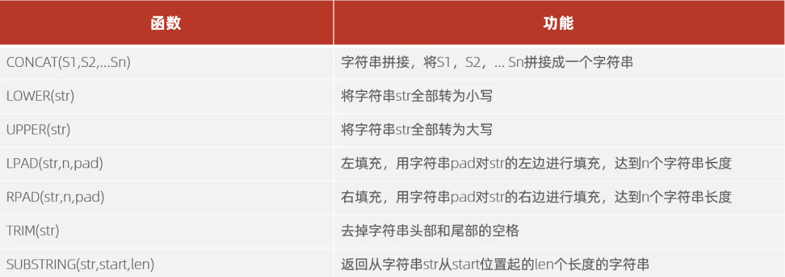
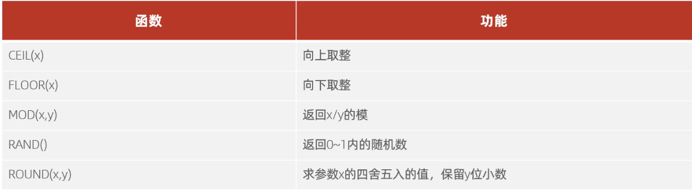
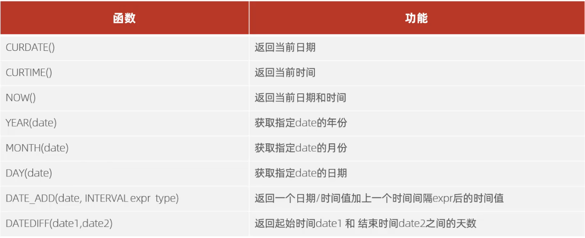
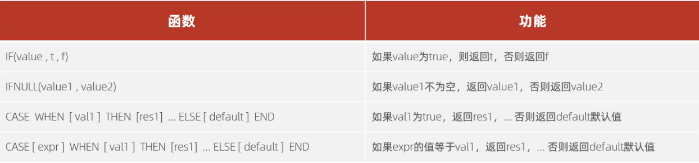

# 函数
函数是指一段可以直接被另一段程序调用的程序或代码（在 MySQL 里面，我们主要要学会如何调用函数）

MySQL 中调用函数的方法
```sql
SELECT 函数(参数)
```

## 字符串函数
常见的字符串函数如下所示


> #### 例子
> ```sql
> # 把 'hello' 和 ' world' 拼接起来
> SELECT CONCAT('hello', 'world');
> 
> # 把 'Hello' 转换为小写
> SELECT LOWER('Hello');
>
> # 把 'Hello' 转换为大写
> SELECT UPPER('Hello');
>
> # 左填充，结果为 '---01'
> SELECT LPAD('01',5,'-');
>
> # 右填充，结果为 '01---'
> SELECT RPAD('01',5,'-');
>
> # 去除 ' hello ' 的两边的空格
> SELECT TRIM(' hello ');
>
> # 截取 'hello world' 中的 'hello'
> # 注意：MySQL 中的索引值是从 1 开始的
> SELECT SUBSTRING('hello world', 1, 5);
> ```

> #### Tips
> - 使用 LPAD 时，如果原来字符串的长度已经超过了指定的长度，则会从**左边**截取指定长度位的数据并返回
> - 使用 RPAD 时，如果原来字符串的长度已经超过了指定的长度，则会从**右边**截取指定长度位的数据并返回
> - 使用 SUBSTRING 时，如果截取的子串长度过长，则只会截取到原字符串的有效部分
> - 使用 SUBSTRING 时，如果截取的位置超过了子串长度，则会返回一个空子串

## 数值函数
常见的数值函数如下所示


> #### 例子
> ```sql
> # 把 1.1 向上取整（2）
> SELECT CEIL(1.1);
> 
> # 把 1.9 向下取整（1）
> SELECT FLOOR(1.9);
>
> # 求 7 % 3
> SELECT MOD(7, 3);
>
> # 获取一个 0 到 1 之间的随机数
> SELECT RAND();
>
> # 右填充，结果为 '01---'
> SELECT RPAD('01',5,'-');
>
> # 对 2.495 进行四舍五入，保留整数/一位小数/两位小数
> SELECT ROUND(2.495, 0);
> SELECT ROUND(2.495, 1);
> SELECT ROUND(2.495, 2);
>
> # 通过 MySQL 的函数，生成一个六位数的随机验证码
> SELECT LPAD(ROUND(RAND() * 1000000, 0), 6, '0');
> ```

> #### Tips
> - ROUND 中的第二个参数可以取小数，它会先将小数四舍五入到整数，然后再执行 ROUND 函数

## 日期函数
常见的日期函数如下所示


> #### 例子
> ```sql
> # 获取当前的日期
> SELECT CURDATE();
>
> # 获取当前的时间（时：分：秒）
> SELECT CURTIME();
>
> # 获取当前的日期和时间（日期 + 时：分：秒）
> SELECT NOW();
> 
> # 获取指定 date 的年份
> SELECT YEAR('2021-08-15');
>
> # 获取指定 date 的月份
> SELECT MONTH('2021-08-15');
>
> # 获取指定 date 的日期
> SELECT DAY('2021-08-15');
>
> # 获取当前日期往后 70 天后的日期
> SELECT DATE_ADD(CURDATE(), INTERVAL 70 DAY);
>
> # 返回现在和 2021-08-15 之间相差的天数
> # 是 CURDATE() 减去 '2021-08-15' 的天数
> SELECT DATEDIFF(CURDATE(), '2021-08-15');
> ```

> #### Tips
> - 获取指定日期的年/月/日时，如果年/月/日不合法，则会返回 NULL

## 流程函数
常见的流程函数如下


> #### 例子
> ```sql
> # if
> SELECT IF(1=2, 'true', 'false');
> SELECT IF(1=1, 'true', 'false');
> 
> # ifnull
> SELECT IFNULL(NULL, 'not null');
> SELECT IFNULL('not null', NULL);
> SELECT IFNULL(NULL, NULL);
>
> # case
> # 查询 emp 表的员工姓名和工作地址（北京上海-->一线城市， 其他-->二线城市）
> SELECT name, (CASE workaddress 
>    WHEN  '北京' THEN '一线城市'
>    WHEN  '上海' THEN '一线城市'
>    ELSE  '二线城市'
>END) AS '工作地址' FROM emp;
> ```

> #### Tips——一个 IF 关键字的巧妙用法
> IF 可以和 SUM 结合，用于解决这个问题：统计 rating 列的值小于 3 的数量
> 写法：
> ```sql
> SUM(IF(rating < 3, 1, 0));
> ```