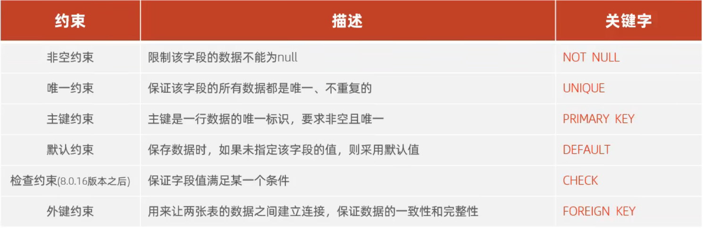
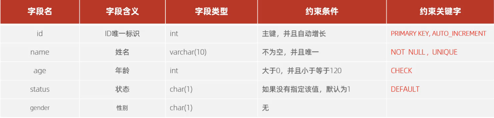
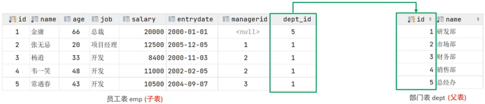
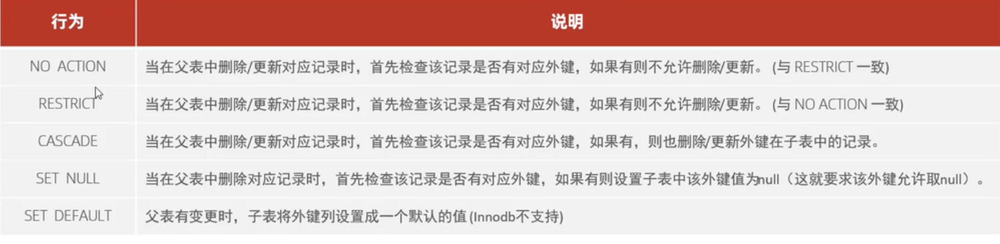

# 约束
## 约束概述
- 概念：约束是作用于表中**字段**上的规则，用于限制存储在表中的数据
- 目的：保证数据库中数据的正确、有效、完整性

不同种类的约束


注意：由于约束是作用于表中**字段**上的规则，因此可以在**创建/修改**表的时候添加约束

## 约束演示
考虑下面这个需求


有 sql 命令如下
```sql
CREATE TABLE customers (
    id INT PRIMARY KEY AUTO_INCREMENT,
    name VARCHAR(10) NOT NULL UNIQUE,
    age INT CHECK (age >= 0 AND age <= 120),
    status CHAR(1) DEFAULT '1',
    gender CHAR(1)
)COMMENT "This is a test table";
```

> #### Tips——埋下的问题
> 为什么数据插入失败时 AUTO_INCREMENT 字段也会加 1

## 外键约束
外键用来让两张表的数据之间建立连接，从而保证数据的一致性和完整性

### 外键，父表和从表
考虑下面这个实例


员工表中有一个字段 dept_id，该字段存储的是员工所在部门的 ID 值，而这个 ID 值又作为**主键**出现在了部门表中。因此这个 dept_id 就是员工表的**外键**

由于 dept_id 
- 作为外键出现在了员工表中
- 作为主键出现在了部门表中

即通过**外键**让两张表中的数据产生了连接，因此我们称**含有外键的表**为**子表**，**外键作为主键的表**为**父表**

> #### Tips
> 目前上述的两张表，在数据库层面并没有建立外键关联，所以是**无法**保证数据的一致性和完整性的

### 建立外键关联
有两种方法建立外键关联：
- 创建表的时候建立外键关联
- 表创建后，给字段添加外键关联

```sql
# 如果是创建表时建立外键关联，则需要先创建字段再对其进行关联
CREATE TABLE 表名(
    字段名 数据类型 其他约束（不包括外键约束）,
    CONSTRAINT 外键名称 FOREIGN KEY (外键字段名) REFERENCES 主表(主表列名)
);

# 表创建后，给字段添加外键关联
ALTER TABLE 表名 ADD CONSTRAINT 外键名称 FOREIGN KEY (外键字段名) REFERENCES 主表(主表列名);

# 删除外键
ALTER TABLE 表名 DROP FOREIGN KEY 外键名称;
```

例子——创建表的时候建立外键关联
```sql
CREATE TABLE dept (
    id INT PRIMARY KEY AUTO_INCREMENT,
    name VARCHAR(50) NOT NULL
);

CREATE TABLE emp (
    id INT PRIMARY KEY AUTO_INCREMENT,
    name VARCHAR(50) NOT NULL UNIQUE,
    age INT CHECK (age >= 0 AND age <= 100),
    # 先声明，再建立外键关系
    dept_id INT NOT NULL,
    CONSTRAINT fk_dept_id FOREIGN KEY (dept_id) REFERENCES dept(id)
);
```

例子——表创建后，给字段添加外键关联，并删除外键关联
```sql
CREATE TABLE emp (
    id INT PRIMARY KEY AUTO_INCREMENT,
    name VARCHAR(50) NOT NULL UNIQUE,
    age INT CHECK (age >= 0 AND age <= 100),
    dept_id INT NOT NULL
);

ALTER TABLE emp ADD CONSTRAINT fk_dept_id FOREIGN KEY (dept_id) REFERENCES dept(id);

# 删除外键关联
ALTER TABLE emp DROP FOREIGN KEY fk_dept_id;
```

### 外键的删除/更新行为
常见外键的删除/更新行为如下


命令为
```sql
ALTER TABLE 表名 ADD CONSTRAINT 外键名称 FOREIGN KEY (外键字段) REFERENCES 主表名(主表字段名) ON UPDATE 更新行为 ON DELETE 删除行为
```

考虑运行这一段 sql 语句
```sql
# 给 dept 表插入一部分数据
INSERT INTO dept (name) VALUES
('Sales'),
('Marketing'),
('Finance'),
('HR');

# 给 emp 表插入一部分数据
INSERT INTO emp (name, age, dept_id) VALUES
('John', 30, 1),
('Mary', 25, 1),
('Tom', 40, 1),
('Jane', 35, 4);

# 把 id = 1 的 id 
UPDATE dept SET id = 5 WHERE id = 1;
```

此后可以发现 emp 中 dept_id = 1 的项的 dept_id 都改为了 5

```sql
# 此后再执行
DELETE FROM dept WHERE id = 5;
# 会发现 emp 中 dept_id = 5 的行都被删除了 ！
```