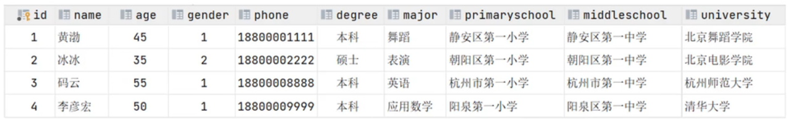
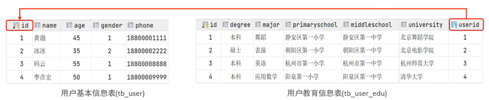
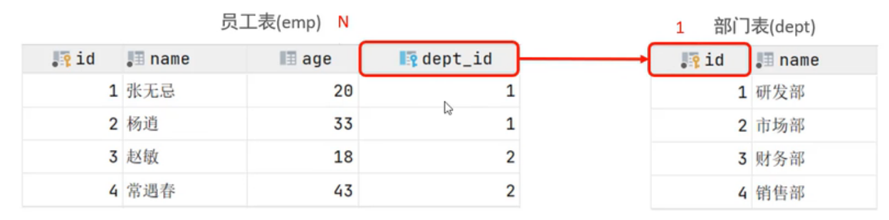
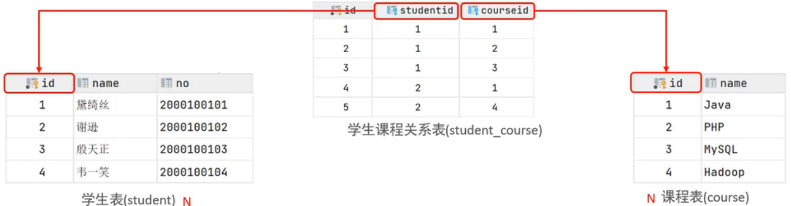
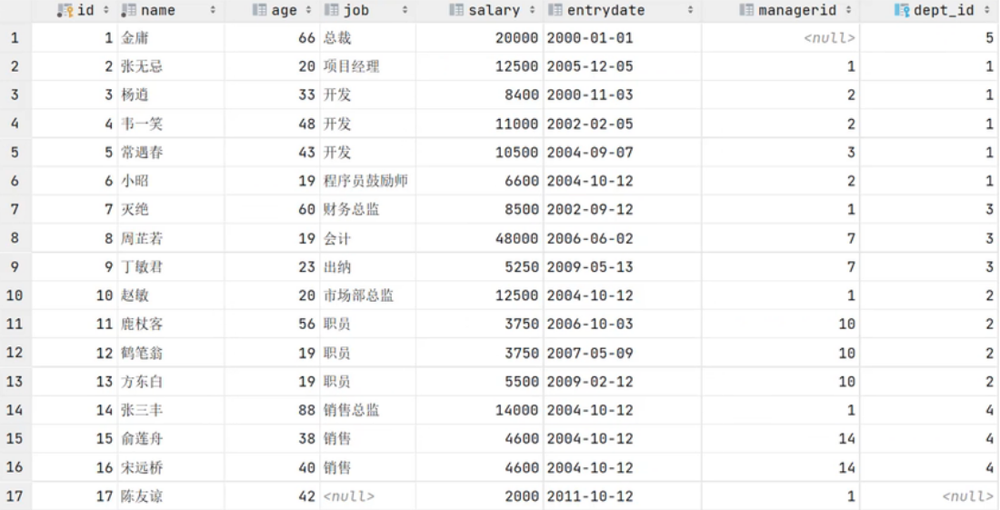
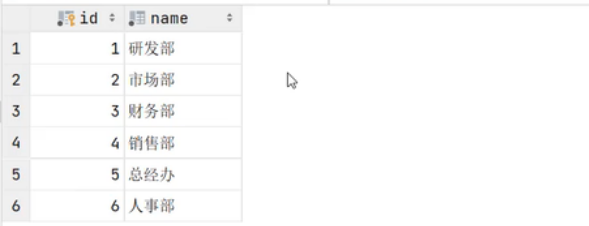
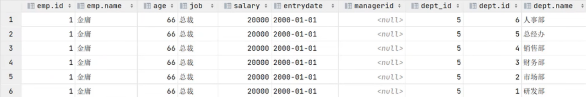
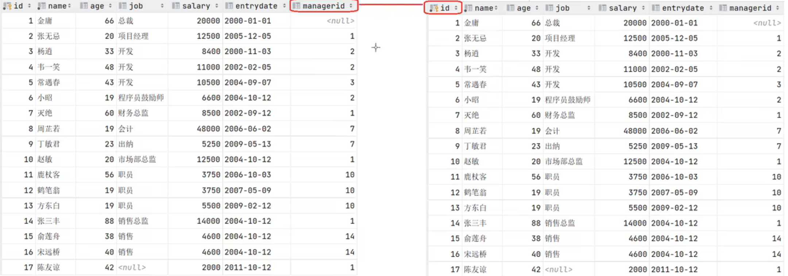
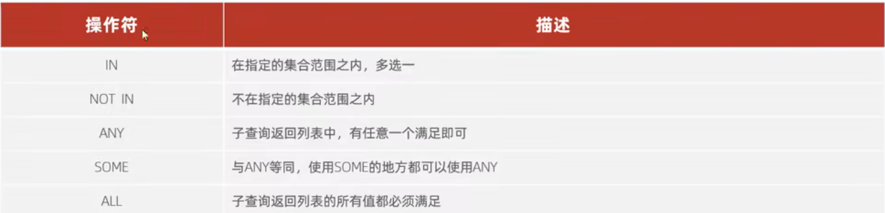

# 多表查询
## 多表关系介绍
项目开发中，在进行数据库表结构设计时，会根据业务需求及业务模块之间的关系，分析并设计表结构，由于业务之间相互关联，所以各个表结构之间也存在着各种关系，基本上分为 3 种：
- 一对一
- 一对多（多对一）
- 多对多

> #### Tips
> 多表查询中可能会用到 ON 和 WHERE，注意 ON 在 WHERE **之前**

### 一对一
案例：用户与用户详情的关系
关系：一对一关系，多用于单表拆分，将一张表的基础字段放在一张表中，其他详情字段放在另一张表中，以提升操作效率
实现：在**任意一方**加入**外键**，关联另外一方的主键，并且设置外键为 **UNIQUE**

> #### 例子
> 假设有这样的一张表
> 
>
> 我们可以把 phone 之后的字段提取出来做成一张表，有：
> 
>
> 其中 tb_user_edu 中的 user_id 关联了 tb_user 的 id 字段

### 一对多（多对一）
案例：部门和员工的关系
关系：一个部门对应多个员工，一个员工对应一个部门
实现：在**多**的一方建立**外键**，指向**一**的一方的**主键**

> #### 例子
> 在上面的案例中，员工表是 '多'，而部门表是 '一'，因此有
> 

### 多对多
案例：学生与课程的关系
关系：一个学生可以选修多门课程，一门课程可以被多名学生选修
实现：**建立第三张中间表**，中间表至少包含**2个外键**，分别关联两方主键

> #### 例子
> 对于上面的案例，有：
> 

> 此处我们创建了第三张表——学生课程关系表，其中 studentid = n 代表 id = n 的学生，其右边是所选的课程

## 多表查询概述 {#section1}
多表查询，即从多张表中查询数据

假设我们有两个表 emp（员工表）, dept（部门表）




我们想看看 emp 中的员工到底属于哪一个具体部门

> #### 问题——能不能这样写？
> 一种写法是：
> ```sql
> SELECT * FROM emp, dept
> ```
> 这种写法是 **错误的**，它会列举出 emp 和 dept 的所有组合情况，即设 $Card(emp) = n$，$Card(dept) = m$，则上面 sql 语句查询出来的表的行数有 $m \times n$，这种情况叫做**笛卡尔积**，如下图所示（我们只希望出现第 2 行，但是这样写会出现 6 行）：
> 
> 
> 多表查询的一个要点就是消除**无效的笛卡尔积**

通过上面的例子，我们发现我们想要的是 emp 表中的 dept_id 和 dept 表中的 id 相同，故有：
```sql
SELECT * FROM emp, dept WHERE emp.dept_id = dept.id;
```

### 多表查询分类
- 连接查询
  - 内连接
  - 外连接
    - 左外连接
    - 右外连接
  - 自连接
- 子查询

## 连接查询
### 内连接
内连接查询的是两张表**交集**的部分，一般分为两种
- 隐式内连接
```sql
SELECT 字段列表 FROM 表1, 表2 WHERE 条件...;
```

- 显示内连接
```sql
SELECT 字段列表 表1 INNER JOIN 表2 ON 连接条件...;
```

> #### 例子
> [跳转emp表](#section1)
> 查询每一个员工的姓名，以及关联部门的名称（**隐式内连接**实现）
> ```sql
> SELECT emp.name, dept.name FROM emp, dept WHERE emp.dept_id = dept.id;
> ```
> 查询每一个员工的姓名，以及关联部门的名称（**显式内连接**实现）
> ```sql
> SELECT emp.name, dept.name FROM emp INNER JOIN dept ON emp.dept = dept.id;
> ```

> #### Tips
> 前面我们说过，可以给表起别名，例如：
> ```sql
> SELECT e.name, d.name from emp e, dept, d WHERE e.dept_id = d.id;
> ```
> 起了别名之后，就不能再用 emp 和 dept 了

可以发现，emp.id = 17 的行没有办法显示（因为不符合 WHERE 的条件），但是有时我们想要显示 emp 的所有信息，此时就要用到**外连接**了

### 外连接
- 左外连接（相当于查询表 1 的所有数据以及表 1 和表 2 交集部分的数据）
```sql
SELECT 字段列表 FROM 表1 LEFT OUTER JOIN 表2 ON 条件;
```
- 右外连接（相当于查询表 2 的所有数据以及表 1 和表 2 交集部分的数据）
```sql
SELECT 字段列表 FROM 表1 RIGHT OUTER JOIN 表2 ON 条件;
```

> #### 例子
> [跳转emp表](#section1)
> 查询 emp 表所有数据，以及对应部门的名称
> ```sql
> SELECT emp.*, dept.name FROM emp LEFT OUTER JOIN dept ON emp.dept_id = dept.id;
> ```
> 查询每一个部门所对应的员工信息（即查询 dept 表的所有数据，以及对应员工的信息）
> ```sql
> SELECT dept.*, emp.* FROM emp RIGHT OUTER JOIN dept ON emp.dept_id = dept.id;
> ```

### 自连接
自连接就是**自己连接自己**，因此整个过程中只有**一张表**参与了查询过程

自连接的语法：
```sql
# 在自连接中，必须起别名
SELECT 字段列表 FROM 表A 别名A JOIN 表B 别名B ON 条件...;
```

> #### Tips
> 自连接查询，可以是**内连接**查询，也可以是**外连接**查询
> - 如果是内连接，就直接写 JOIN
> - 如果是外连接
>   - 如果是左外连接：写 LEFT JOIN
>   - 如果是右外连接：写 RIGHT JOIN

> #### 例子
> [跳转emp表](#section1)
> 1. 查询 emp 表中员工及其所属领导的名字
> 
> 分析：观察 emp 表，可以发现有一个叫做 managerid 的字段，该字段对应了员工的所属领导，而**领导也是公司的员工**，因此可以将 emp 表复制一份：
> 
>
> 设左边的表为 a，右边的表为 b，故当 a.managerid = b.id 时，即可以查询到每个员工的所属领导
> 因此有 sql 语句（内连接）
> ```sql
> SELECT a.name, b.name FROM emp a JOIN emp b ON a.managerid = b.id;
> # 另一种写法
> SELECT a.name, b.name FROM emp a, emp b WHERE a.managerid = b.id;
> ```
>
> 2. 在 （1）的基础上，实现：如果员工没有领导，也需要查询出来
>
> 分析：此时需要用到左外查询，有 sql 语句
> ```sql
> SELECT a.name, b.name FROM emp a LEFT JOIN emp b ON a.managerid = b.id;
> ```

### 补充——联合查询
sql 语句如下
```sql
SELECT 字段列表 FROM 表A ...
UNION [ALL]
SELECT 字段列表 FROM 表B ...;
```

> #### Tips
> 1. UNION 和 UNION ALL 的区别
>
> - UNION ALL 会将所有查询结果**直接合并在一起**，可能会有**重复的查询结果**
> - UNION 会对所有查询结果进行**去重**，不会有重复的查询结果
>
> 2. 字段列表必须保持一致

## 子查询
SQL 语句中嵌套 SELECT 语句，称为**嵌套查询**，又称**子查询**
语法
```sql
SELECT * FROM t1 WHERE column1 = (SELECT column1 FROM t2);
```

> #### Tips
> 子查询外部的语句可以是 INSERT/UPDATE/DELETE/SELECT 的任何一个

根据子查询结果的不同，分为：
- 标量子查询（子查询结果为单个值，例如数字，字符串，日期）
- 列子查询（子查询结果为一列）
- 行子查询（子查询结果为一行）
- 表子查询（子查询结果为多行多列）

根据子查询位置，分为：
- WHERE 之后
- FROM 之前
- SELECT 之后

### 标量子查询
常用的操作符：$\geq, >, =, !=, \leq, <$

> #### 例子
> [跳转emp表](#section1)
> 查询销售部的所有员工信息
> 分析：将这一任务进行分解，可以分为下面两步：
> 1. 查询销售部对应的 id
> ```sql 
> SELECT id FROM dept WHERE name = '销售部';
> # 得出销售部的 id 为 4
> ```
> 2. 根据销售部的 id，查询员工信息
> ```sql
> SELECT * FROM emp where dept_id = 4;
> ```
> 实际上，我们发现 dept_id 就等于第一条 sql 语句的结果，因此有：
> ```sql
> SELECT * FROM emp WHERE dept_id = (SELECT id FROM dept WHERE name = '销售部');
> ```

### 列子查询
常用的操作符：IN、NOT IN、ANY、SOME，ALL。它们的含义如下表所示


> #### 例子
> [跳转emp表](#section1)
> 查询销售部和市场部的所有员工信息
> 分析：将这一任务进行分解，可以分为下面两步：
> 1. 查询销售部和市场部对应的 id
> ```sql 
> SELECT id FROM dept WHERE name = '销售部' OR name = '市场部';
> # 此时获得了一个 2 行 1 列的表，表中存储的是销售部和市场部的 id
> ```
> 2. 根据销售部和市场部的 id，查询员工信息
> ```sql
> # 此处可以直接用 IN 
> SELECT * FROM emp WHERE dept_id IN (2,4);
> ```
> 实际上，我们发现括号中的内容就等于第一条 sql 语句的结果，因此有：
> ```sql
> SELECT * FROM emp where dept_id IN (SELECT id FROM dept WHERE name = '销售部' OR name = '市场部');
> ```

> #### 例子
> [跳转emp表](#section1)
> 查询比财务部所有人工资都高的员工信息
> 分析：将这一任务进行分解，可以分为下面两步：
> 1. 查询财务部的所有人员工资
> ```sql 
> SELECT salary FROM emp WHERE dept_id = (SELECT id FROM dept WHERE name = '财务部');
> ```
> 2. 查询比财务部所有人员工资都高的员工信息
> ```sql
> # 财务部的最高工资是 8500
> SELECT * FROM emp WHERE salary > 8500;
> ```
> 实际上，我们发现当某员工工资大于财务部所有人员工资时，它就一定大于 8500，因此有：
> ```sql
> # 这里的 ALL 代表 salary 要大于括号中结果的所有值
> # 如果要求 salary 大于括号中结果的最小值，则可以使用 SOME/ANY
> SELECT * FROM emp WHERE salary > ALL (SELECT salary FROM emp WHERE dept_id = (SELECT id FROM dept WHERE name = '财务部'));
> ```

### 行子查询
常见操作符：$=、!=$、IN、NOT IN

> #### 补充——一种新的条件匹配方式
> 考虑下面这条 sql 语句
> ```sql
> SELECT * FROM emp WHERE salary = 12500 and managerid = 1;
> ```
> 实际上，有一种新的写法如下
> ```sql
> SELECT * FROM emp WHERE (salary, managerid) = (12500, 1);
> ```

> #### 例子
> [跳转emp表](#section1)
> 查询与 '张无忌' 的薪资及直属领导相同的员工信息
> 可以拆分为两步：
> 1. 查询 '张无忌' 的薪资和直属领导
> ```sql
> SELECT salary, managerid FROM emp WHERE name = '张无忌';
> ```
>
> 2. 查询与 '张无忌' 的薪资及直属领导相同的员工信息可以拆分为两步：
> ```sql
> SELECT * FROM emp WHERE (salary, managerid) = (12500, 1);
> ```
> 我们发现第二个 sql 语句括号内的内容就是第一跳语句的结果，因此有：
> ```sql
> SELECT * FROM emp WHERE (salary, managerid) = (SELECT salary, managerid FROM emp WHERE name = '张无忌');
> ```

### 表子查询
常见操作符：IN
经常出现在 FROM 之后
> #### 例子
> 查询入职日期是 '2006-01-01' 之后的员工信息，以及部门信息
> 分两步：
> 1. 查询入职日期是 '2006-01-01' 之后的员工信息
> ```sql
> SELECT * FROM emp WHERE entrydate > '2006-01-01';
> ```
>
> 2. 查询入职日期是 '2006-01-01' 之后的员工信息，以及部门信息（此处需要用到左外连接）
> ```sql
> SELECT e.*, d.* FROM (SELECT * FROM emp WHERE entrydate > '2006-01-01') e LEFT JOIN dept d ON e.dept_id = d.id;
> ```