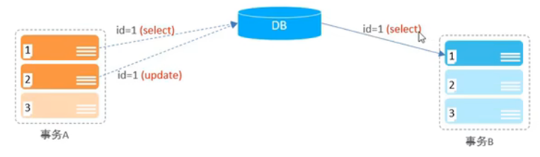
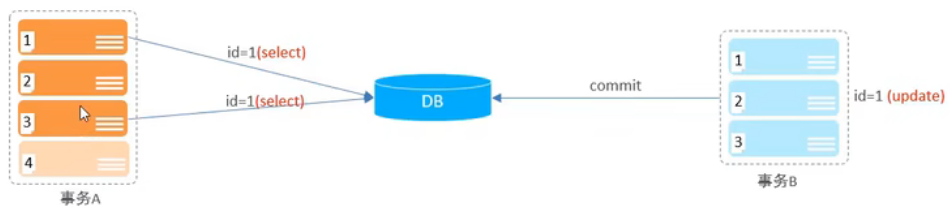
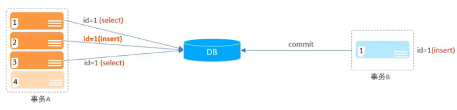
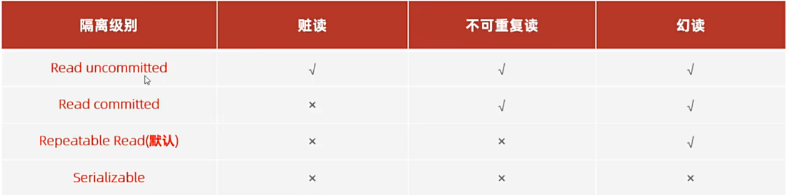

# 事务
事务是一组操作的集合，它是一个**不可分割**的工作单位，事务会把所有的操作作为一个整体一起向系统提交或撤销操作请求，即这些操作**要么同时成功，要么同时失败**

## 事务操作
- 查看/设置事务提交方式
```sql
# 查看事务的提交方式（如果为 1 则是自动提交；为 0 则是手动提交）
SELECT @@autocommit;
# 设置事务提交方式
SET @@autocommit = 0;
```
- 开启事务
```sql
START TRANSACTION;
```
- 提交事务
```sql
COMMIT;
```
- 回滚事务
```sql
ROLLBACK;
```

> #### Tips
> 在 COMMIT 之前，数据库中的数据只是**看起来被修改了**，实际上在磁盘中**还没有被修改**（可以通过 ROLLBACK 操作来验证）

## 事务的四大特性（ACID）
- 原子性：事务是不可分割的最小操作单元，**要么全部成功，要么全部失败**
- 一致性：事务完成时，必须使所有数据都保持**一致状态**
- 隔离性：数据库系统提供的隔离机制，保证事务在**不受外部并发操作影响的独立环境下**运行
- 持久性：事务一旦提交或回滚，它对数据库中数据的改变是**永久的**

## 并发事务问题
常见的并发事务问题有 3 种：


### 脏读
考虑下面这种情况：


事务 A 的第二条语句（更新 id = 1 的数据）执行之后，事务 B 的第一条语句执行（读 id = 1 的数据），此时 B 拿到了**更新后的数据**，但是 A 还没有提交，这就是**脏读**。

如果事务 A 出现了**回滚**，则会导致事务 B 取到了一个**无效的数据**

### 不可重复读
考虑下面这种情况：


事务 A 先查询 id = 1 的数据，然后执行第二条语句，在第二条语句执行完之前，事务 B 执行了 3 条语句，导致 id = 1 的数据被更新了。此后事务 A 再查询 id = 1 的数据，这一次查询和上一次查询的数据是**不一样**的，这就是**不可重复读**

### 幻读
考虑下面这种情况，我们假设 id 为主键，且不可重复读的问题没有被解决


假设开始数据库中不存在 id = 1 的数据，事务 A 先执行了查询操作，并发现了这一点，正当它准备插入 id = 1 的数据时，事务 B 完成了插入（同时提交了）。此时数据库中已经有了 id = 1 的数据，故事务 A 的插入操作会**报错**。此时事务 A 会再执行一条查询语句，而 A 查询到的结果是：数据库中**有** id = 1 的数据

> #### Tips
> 如果解决了不可重复读的问题，对于上面的场景，会出现：事务 A 插入 id = 1 的数据会报错，但是事务 A 查询 id = 1 的数据时会发现数据库中**没有** id = 1 的数据

> #### Tips——不可重复读和幻读的区别
> - 不可重复读：A 事务读取了 B 事务已经提交的**更改数据**
> - 幻读：A 事务读取了 B 事务提交的**新增数据**

### 事务隔离级别
以下是常见的 4 种事务隔离级别，打钩代表在这种隔离级别下，脏读/不可重复读/幻读**会出现**


- 其中 MySQL 的默认隔离级别是 Repeatable Read
- 从上到下隔离级别**越来越高**，但是性能**越来越差**

查看事务隔离级别
```sql
SELECT @@TRANSACTION_ISOLATION;
```

设置事务隔离级别
```sql
# SESSION（会话级别）: 仅针对当前会话有效
# GLOBAL（全局级别）: 针对所有客户端的会话窗口有效 
SET [SESSION | GLOBAL] TRANSACTION ISOLATION LEVEL [READ UNCOMMITTED | READ COMMITTED | REPEATABLE READ | SERIALIZABLE];
```