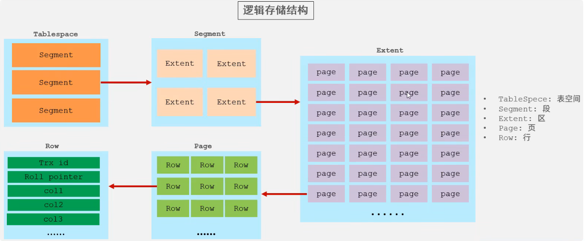
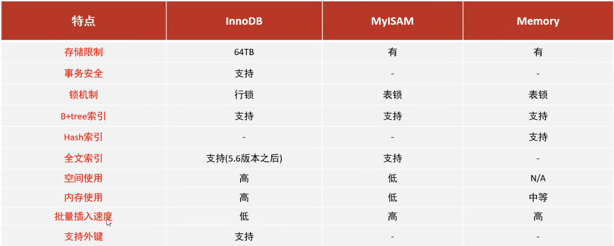

# 存储引擎
## 存储引擎简介
存储引擎就是存储数据、建立索引、更新/查询数据等技术的实现方式。存储引擎**是基于表的**，**不是基于数据库的**，所以存储引擎可以被称为**表类型**

查看当前数据库支持的存储引擎
```sql
SHOW ENGINES;
```

在创建表时，指定存储引擎
```sql
CREATE TABLE 表名 (
    ...
) ENGINE = 需要的引擎;
```

## 存储引擎特点
### InnoDB
InnoDB 是一种**兼顾高可靠性和高性能**的通用存储引擎，在 MySQL 5.5 之后，InnoDB 是默认的 MySQL 存储引擎

#### InnoDB 特点
- DML 操作遵循 ACID 模型，支持**事务**
- **行级锁**，提高并发访问性能
- 支持**外键** FOREIGN KEY 约束，保证数据的完整性和正确性

#### InnoDB 的磁盘文件
xxx.ibd：xxx 代表的是**表名**，InnoDB 引擎的每张表都会对应这样一个表空间文件，存储该表的表结构（frm，sdi）、数据和索引
参数：innodb_file_per_table

#### InnoDB 逻辑存储结构
InnoDB 的逻辑存储结构由 **5** 部分组成：
- TableSpace：表空间（ibd 文件就是表空间文件）
- Segment：段
- Extent：区（大小固定为 **1M**）
- Page：页（**磁盘操作的最小单元**，大小固定为 **16K**）
- Row：行（表结构中存储的一行一行的数据）

> #### Tips
> 实际上，一行中又包含了若干信息：
> - Trx_id：最后一次操作事务的 id
> - Roll_pointer：回滚指针
> - 字段



### MyISAM
MyISAM 是 MySQL 早期的默认存储引擎

#### MyISAM 特点
- 不支持事务，不支持外键
- 支持表锁，不支持行锁
- 访问速度快

#### MyISAM 的磁盘文件
- xxx.sdi：存储表结构信息
- xxx.MYD：存储数据
- xxx.MYI：存储索引

### Memory
Memory 引擎的表数据是存储在**内存**中的，由于受到硬件/断电问题的影响，只能将这些表作为**临时表或缓存**使用

#### Memory 特点
- 内存存放
- hash 索引（默认）

#### Memory 的磁盘文件
xxx.sdi：存储表结构信息

### InnoDB、MyISAM、Memory 的特点


## 存储引擎选择
- InnoDB：应用对事物的**完整性**有较高要求，在并发条件下要求数据的**一致性**。数据除了插入和查询之外，还包含很多的**更新，删除**操作
- MyISAM：应用以**读/插入**操作为主，只有很少的**更新/删除**操作，并且对完整性，并发性要求不高
- MEMORY：临时表以及缓存