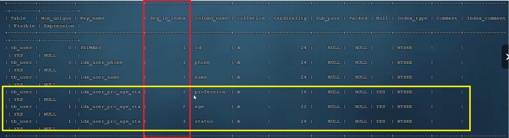
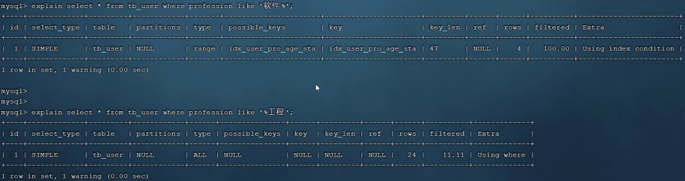

# 索引
## 索引概述
索引是帮助 MySQL 高效获取数据的**数据结构（有序）**。在数据之外，数据库系统还维护着满足特定查找算法的数据结构，这些数据结构以某种方式引用数据，这样就可以在这些数据结构上实现**高级查找算法**，这种数据结构就是索引

索引的优点
- 提高数据检索的效率，降低数据库的 IO 成本
- 通过索引列对数据进行排序，降低数据排序的成本，降低 CPU 的消耗
  
索引的缺点
- 索引列要占用空间
- 索引大大提高了查询效率，同时却也降低更新表的速度，例如对表进行 INSERT、UPDATE、DELETE 时，效率降低

> #### Tips
> 总而言之，索引是用来**提高查询效率的**

## 索引结构
MySQL 的索引是在**存储引擎层**实现的，不同的存储引擎有不同的结构，主要包括下面几种：


不同存储引擎的索引支持情况如下：


### 索引数据结构
#### B Tree（多路平衡查找树）
以一颗最大度数为 5 的 B Tree 为例（每个节点最多存储 4 个 key，5 个指针）


B Tree 的插入操作是指插入一条记录，即（key, value）的键值对。对于一个阶为 m 的 B Tree，插入操作的流程如下：
- 如果 B 树中已经存在需要插入的键值对，则用需要插入的 value 替换旧的 value
- 如果 B 树中不存在这个 key，则一定是在**叶子节点中**进行插入操作，操作如下
  - 1.根据要插入的 key 的值，找到叶子节点并插入（这一步比较像二叉检索树的插入）
  - 2.判断当前节点 key 的个数是否**小于等于 m - 1**，若满足则结束，某则进行第三步
  - 3.以节点**中间的 key 为中心**分裂成左右两部分，然后将这个中间的 key 插入到父节点中（同时这个中间的 key 在本节点**消失**），这个 key 的**左子树**指向分裂后的**左半部分**；**右子树**指向分裂后的**右半部分**，然后将当前节点指向父节点，继续进行第三步（判断父节点插入数据后，key 的个数是否小于等于 m - 1）

关于 B Tree 插入操作的实例和 B Tree 的其他操作，参考：[传送门——B Tree 详解](https://www.cnblogs.com/nullzx/p/8729425.html)

#### B+Tree
B+Tree 是 B Tree 的一个变种，区别在于：
- B+Tree 的**所有数据**（主要是非叶子节点的数据）最终都会出现在**叶子节点**，因此非叶子节点仅仅是起到了**索引**的作用，而没有存储数据；真正存放数据的节点是**叶子节点**
- 叶子节点形成了一个**单向链表**，每一个节点都会通过一个指针指向下一个节点


B+Tree 的插入操作和 B Tree 类似，操作的差异主要出现在第 3 步：
- 将中间的 key 插入到父节点中时，这个中间的 key **不会在本节点消失**
- 如果当前节点是叶子节点，那么完整插入操作后，两个分裂的节点会用一个指针连接，形成**链表**

关于 B+Tree 插入操作的实例和 B+Tree 的其他操作，参考：[传送门——B+Tree 详解](https://www.cnblogs.com/nullzx/p/8729425.html)

> #### Tips
> MySQL 索引数据结构对经典的 B+Tree 进行了优化，它将叶子结点的单向链表改为了**双向循环链表**
>
> 

> #### 问题——为什么 InnoDB 存储引擎选择使用 B+Tree 索引结构
> - 相对于二叉树，层级**更少**，搜索效率高
> - 对于 B Tree，无论是叶子节点还是非叶子节点，都要存储数据，这样导致一页中存储的键值减少，指针跟着减少，要保存大量数据时，只能增加树的**高度**

#### Hash
Hash 索引就是采用一定的 Hash 算法，将**键值**换算成**新的 Hash 值**，映射到对应的槽位上，然后存储在 Hash 表中
如果多个键值映射到一个相同的槽位上，他们就产生了 **Hash 冲突**（也称为 Hash 碰撞），可以通过**链表**来解决


Hash 索引的特点如下
- Hash 索引只能用于**对等比较**（例如 =，IN），**不支持范围查询**（例如 BETWEEN，<，>，...）
- **无法**利用索引完成**排序**操作
- 查询**效率高**，通常只需要一次检索就可以了（不出现 Hash 碰撞），效率通常高于 B+Tree 索引

## 索引分类


在 InnoDB 存储引擎中，根据索引的存储形式，又可以分为以下两种：


> #### 例子——聚集索引和二级索引
> 

聚集索引的选取规则
- 如果存在主键，**主键索引**就是聚集索引
- 如果不存在主键，将使用**第一个唯一（UNIQUE）索引**作为聚集索引
- 如果不存在主键，或没有合适的唯一索引，则 InnoDB 会自动生成一个 rowid 作为隐藏的聚集索引

### 回表查询
回表查询：先走**二级索引**找到对应的**主键值**，再根据**主键值**来到**聚集索引**当中拿到这一行的**行数据**

> #### 例子——回表查询
> 考虑下面这个语句：
> ```sql
> SELECT * FROM user WHERE name = 'Arm';
> ```
>
> 由于它是通过 name 字段查询的，因此会先走下面的**二级索引**（name 字段的索引），通过二级索引找到了 id。然后拿着这个 id 去上面的**聚集索引**中寻找数据，最后才能拿到这一行的数据。这一过程就是**回表查询**

因此回表查询的效率是**较低的**，我们要避免回表查询

## 索引语法
### 创建索引
> #### Tips
> 一个索引是可以关联多个字段的
> - 如果一个索引关联一个字段，则该索引称之为：**单列索引**
> - 如果一个索引关联多个字段，则该索引称之为：**联合索引**

语法
```sql
# 根据表的制定字段创建索引
# 索引名称有特定规范：idx_表名_字段名
CREATE [UNIQUE | FULLTEXT] INDEX 索引名称 ON 表名(字段名1,字段名2,...);
```

> #### 例子
> 表名为：user
> 1. 为 name 字段创建索引（name 字段的值可能会重复）
> ```sql
> CREATE INDEX idx_user_name ON user(name);
> ```
> 2. 为 phone 字段创建索引（phone 字段的值不会重复）
> ```sql
> CREATE UNIQUE INDEX idx_user_phone ON user(phone);
> ```
> 3. 为 profession, age, status 字段创建联合索引
> ```sql
> CREATE INDEX idx_user_prof_age_sta ON user(profession, age, status);
> ```

### 查看索引
语法
```sql
# 查看指定表的索引
SHOW INDEX FROM 表名;
```

### 删除索引
语法
```sql
DROP INDEX 索引名 ON 表名;
```

## SQL 性能分析
在 SQL 优化之前，我们需要先观察不同 SQL 语句的占比，从而了解优化方向（实际上，我们主要优化的是**查询语句**，如果查询语句较少，那么就没有优化的必要了）

### SQL 执行频率
MySQL 客户端连接成功后，通过
```sql
SHOW [SESSION | GLOBAL] status;
```
可以提供服务器状态信息。通过
```sql
# Com 后面是 7 个下划线
SHOW GLOBAL STATUS LIKE 'Com_______';
```
可以查看当前数据库的 INSERT、UPDATE、DELETE、SELECT 的访问频次

> #### Tips
> SQL 执行频率只能知道**哪一类语句**的出现频率比较高，不能确定哪一条语句的出现频率比较高

### 慢查询日志
前面我们知道了 SELECT 语句的执行频率确实很高，现在我们想要知道要针对**哪些 SELECT 语句进行优化**。因此我们需要**慢查询日志**来定位特定的 SELECT 语句

慢查询日志记录了所有执行时间超过制定参数（long_query_time，单位：**秒**，默认 10 秒）的所有 SQL 语句。MySQL 的慢查询日志默认没有开启，需要在 MySQL 的配置文件（/etc/my.cnf）中配置如下信息
```txt
# 开启 MySQL 慢查询日志
slow_query_log = 1;
# 设置慢查询日志的时间为 2 秒，SQL 语句执行时间超过 2 秒，就被视为慢查询，从而记录在日志中
long_query_time = 2;
```
配置完成后，需要重启 MySQL 服务器进行测试

```sql
# 查看慢查询日志是否开启
SHOW VARIABLES LIKE 'slow_query_log';
```

### profile
实际上，前面我们只记录了超过 2 秒的语句，但是有些语句的执行时间可能略低于 2 秒，这类语句实际上也是较慢的，但是慢查询日志无法完成记录，此时就要用到 profile

```sql
# 查看当前数据库是否支持 profile 操作
SELECT @@have_profiling;

# 查看 profiling 是否被打开
SELECT @@profiling;

# 开启 profiling
SET profiling = 1;
```

开启 profile 之后，就可以通过下面指令查看指令的执行耗时
```sql
# 查看每一条语句的耗时基本情况
SHOW profiles;

# 查看指定 query_id 的 SQL 语句各个阶段的耗时情况
# 其中 query_id 体现在使用 SHOW profiles 后的结果中
SHOW profiles FOR query query_id;

# 查看指定 query_id 的 SQL 语句 CPU 使用情况
SHOW profiles cpu FOR query query_id;
```

### :star::star:explain 执行计划
EXPLAIN 或者 DESC 命令获取 MySQL 如何执行 SELECT 语句的信息，包括在 SELECT 语句执行过程中表如何连接和连接的顺序

语法
```sql
# 直接在原来的 SELECT 语句前面加上 EXPLAIN/DESC
EXPLAIN SELECT 字段列表 FROM 表名 WHERE 条件;
```

这个是 EXPLAIN 的结果：


#### EXPLAIN 字段解释
##### id
SELECT **查询的序列号**，表示查询中执行 SELECT 子句或是操作表的顺序
- id 相同：执行顺序**从上到下**（子查询（嵌套 SELECT）中体现）
- id 不同：**id 值越大越先执行**（多表查询中才能体现出来）

> #### 例子——id 相同的情况（多表查询）
> 

> #### 例子——id 不同的情况
> 
>
> 可以发现，EXPLAIN 中展现出的顺序和我们想的一样（从内到外执行）

##### select_type
表示 SELECT 的类别
- SIMPLE：简单表，即**不使用表连接或子查询**
- PRIMARY：主查询，即外层的查询
- UNION：UNION 中的第二个或者后面的查询语句
- SUBQUERY：SELECT/WHERE 之后包含了子查询

##### type
表示连接类型，性能**从高到低**依次是：NULL、system、const、eq_ref、ref、range、index、all。优化时我们需要尽量往前优化

> #### Tips
> - 一般不可能优化为 NULL
> - 访问**系统表**时才会出现 system
> - const：根据**主键/唯一索引**进行访问会出现 const
> - ref：使用**非 UNIQUE**的索引进行查询时会出现 ref
> - index：使用了索引，但是它也会对索引进行扫描，**遍历整个索引树**
> - all：全表扫描（最差！）

##### possible_key
显示**可能**用到的索引（一个或多个）

##### key
**实际**使用的索引，如果为 NULL，则没有使用索引

##### key_len
表示索引中使用的字节数，该值为索引字段**最大可能长度**，并非实际使用长度，在不损失精确性的前提下，**长度越短越好**

##### row
MySQL 认为必须要执行查询的行数，在 InnoDB 引擎的表中，是一个**估计值**，可能**并不总是准确的**

##### filtered
**返回结果的行数**占**读取行数**的百分比，**越大越好**

## 索引使用
### 索引失效的情况
#### 最左前缀法则
最左前缀法则：查询从索引的**最左列**开始，并且**不跳过索引中的列**。如果跳过了某一列，索引将**部分失效**（后面的字段索引失效）
如果使用了**联合索引**，就要遵循**最左前缀法则**

> #### Tips
> 查询时如果没有最左列的索引，则会退化到**全表查询**

> #### 例子——解释最左前缀法则
> 
>
> 其中：
> - status 字段的长度为 5
> - age 字段的长度为 2
> - profession 字段的长度为 47
>
> 1. '最左' 是什么
> 黄色方框部分是一个联合索引，其中红色方框部分是**索引序列数**，索引序列数**越小**，索引就**越靠左**。因此最左边的索引就是 Seq_in_index **最小**的索引
>
> 2. 举例说说什么是最左前缀法则
> - 如果查询没有 profession，则会退化到全表查询
> 
> - 查询中如果跳过了 age 仅包含 profession 和 status，则 status **不会生效**
> 
> - 查询语句中**索引出现的顺序**对查询结果**没有影响**
> 

> #### 问题——为什么会有最左前缀法则
> 索引底层是一个 B+ 树，联合索引在构建 B+ 树的过程中，会**先按照左边的键**进行排序。当左边的键相同时，再依次按照**右边的键排序**。因此没有最左边的键时，就没有办法在 B+ 树上进行搜索

#### 范围查询
**联合索引**中，出现**范围查询**（大于、小于、between、like），范围查询**右侧的列索引失效**

> #### 例子——什么是范围查询
> 
>
> 可以发现 age 右侧的 status 没有走索引（而 age 是走了索引的），因为 age 使用的是**大于**，出现了**范围查询问题**

> #### Tips
> 因此业务中尽量避开**大于/小于/between/like**的使用

#### 索引列运算
**不要**在索引列上进行运算操作，索引将**失效**

> #### 例子
> phone 是一个索引，此时我们在查询语句中对 phone 进行了运算（字符串运算），可以发现索引失效了
> 

#### 字符串不加引号
对于数字字符串，**不加引号**会导致索引失效

> #### Tips
> 实际上，索引失效的深层原因是**两边类型不等**，考虑下面这种情况：phone 是 INT 类型的索引，而使用下面这个 SELECT 查询语句：
> ```sql
> SELECT * FROM tb WHERE phone = '12222244';
> ```
>
> 查询**不会报错**，但是会发现采用的是**全表查询**

#### 模糊查询
- 如果仅仅是**尾部**模糊匹配，索引不会失效
- 如果是**头部**模糊匹配，索引失效

> #### 例子
> 前者是尾部匹配，后者是头部匹配
> 

#### OR 连接的条件
用 or 分割开的条件
- or 条件中只要出现了**非索引列**，将会**全表扫描**
  ```sql
  # id 有索引但是 lo 没有索引
  SELECT * FROM tb WHERE id = 1 OR name = 'lo';
  ```
- or 条件中只出现了**一个**索引，那么就会走索引
  ```sql
  SELECT * FROM tb WHERE id = 1 OR id = 2;
  ```
- or 条件如果是联合索引的话
  - **所有字段**都参与了条件查询，会**全表扫描**
  - 使用了联合索引中**非首字段**进行条件查询，会**全表扫描**
  - 条件为**主键**以及联合索引的**首个字段** a，则会使用主键索引以及联合索引的 a

> #### 例子
> 

#### 数据分布影响
如果 MySQL 评估使用索引比全表扫描**更慢**，则**不使用**索引

### SQL 提示
有的时候某一列可能有一个单列索引，也有可能属于某一个联合索引。此时我们希望 MySQL 使用我们想要的索引，此时就可以用到**SQL提示**

SQL 提示，是优化数据库的一个重要手段，简单来说，就是在 SQL 语句中**加入一些人为的提示**来达到优化操作的目的

- use index：告诉 MySQL 查询优化器在生成执行计划时**考虑**指定的索引。这并**不强制** MySQL 使用这些索引，而是**建议**优化器在选择执行计划时优先考虑这些索引。
```sql
EXPLAIN SELECT * FROM 表名 USE INDEX(建议使用的索引名) WHERE 条件列表
```
- ignore index：告诉 MySQL 查询优化器在生成执行计划时**不要考虑**指定的索引
```sql
EXPLAIN SELECT * FROM 表名 IGNORE INDEX(建议使用的索引名) WHERE 条件列表
```
- force index：强制 MySQL 使用制定的字段
```sql
EXPLAIN SELECT * FROM 表名 FORCE INDEX(建议使用的索引名) WHERE 条件列表
```

### 覆盖索引
尽量使用覆盖索引（查询使用了索引，并且**需要返回的列**，在该索引中已经全部能够找到），减少 SELECT * 的使用。这样做可以**有效避免回表**

> #### Tips
> 实际上，如果需要查询主键，那么主键**可以**不在使用的索引中出现

> #### 问题——为什么覆盖索引可以提高避免回表
> 
>
> 考虑这个语句：
> ```sql
> SELECT id, name FROM tb WHERE name = 'Amy';
> ```
> 我们可以通过 name 查询到 Amy 对应的 id，即只需要**一次**查询就可以获取我们想要的全部信息（覆盖索引）
>
> 下面考虑这个语句：
> ```sql
> SELECT id, name, gender FROM tb WHERE name = 'Amy';
> ```
>
> 我们通过 name 只能获取到 Amy 对应的 id，但是不能获取到 Amy 的 gender，因此我们需要拿着 Amy 的 id（主键），才进行一次查询，即完成了**回表查询**

### 前缀索引
当字段类型为**字符串**时（varchar，text 等）时，有时候需要索引**很长的**字符串，这会让索引变得很大，查询时，浪费大量的磁盘 I/O，影响查询效率。此时可以只用字符串的**一部分前缀**简历索引，从而大大节约索引空间，提高索引效率

语法
```sql
# 使用字段的前 n 个字符建立索引
CREATE INDEX idx_xxx ON 表名(字段名(n));
```

前缀长度 n 的确定：可以根据索引的选择性来决定，而选择性是指**不重复**的索引值与**数据表记录总数**的比值，索引选择性**越高**则查询效率**越高**。**唯一索引**的选择性是 **1**，这是最好的索引选择性，性能也是最好的

求解索引选择性的方法：
```sql
SELECT COUNT(DISTINCT 字段名) / COUNT(*) FROM 表名

# 截取前 m 个字符
SELECT COUNT(DISTINCT SUBSTRING(字段名,1,m)) / COUNT(*) FROM 表名
```