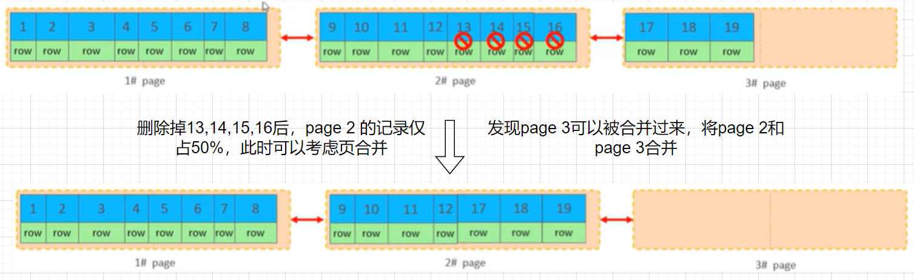
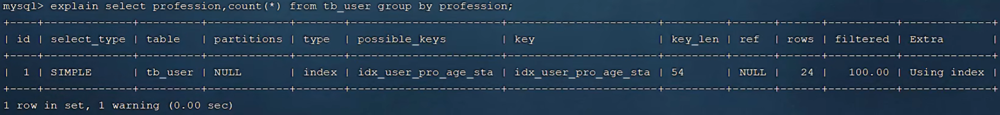

# SQL 优化
## 插入优化
### 批量插入
每次插入数据都要与数据库建立连接并进行网络传输，这个性能相对较低，因此我们需要**批量插入**

```sql
INSERT INTO 表名 VALUES
(...),
(...),
...
(...);
```

> #### Tips
> 就算用批量插入，一次性插入的数据量也要控制在**500到1000行**，如果数据较多，那么需要使用多条批量插入语句

实际上，如果一次要添加超高批量的数据（百万行级别），我们一般会使用**load**指令。使用 load 指令时要进行如下操作
```sql

# 查看 local_infile 是否开启
SELECT @@local_infile;
# 打开 local_infile
SET GLOBAL local_infile = 1;
# 执行 load 指令将准备好的数据加载到表结构中
LOAD DATA LOCAL infile 文件路径 INTO TABLE 表名 fields terminated by 同一行的数据使用什么分隔 lines terminated by 不同行的数据用什么分割（换行符）
```

> #### Tips
> 一般来说，对于大批量数据，load 指令的效率远高于 INSERT 指令（几十倍甚至上百倍） 

### 手动提交事务
MySQL 中的事务提交方式默认是自动提交，这也就意味着
- 当一条 INSERT 语句执行之**前**，需要**开启事务**
- 当一条 INSERT 语句执行之**后**，就**自动提交**了

```sql
START TRANSACTION;
INSERT INTO 表名 VALUES (...), (...) ..., (...);
COMMIT;
```

### 主键顺序插入
主键顺序插入的性能会**高于**主键乱序插入的性能

## 主键优化
### 数据的组织方式
在 InnoDB 存储引擎中，表数据都是根据主键顺序组织存放的，这种存储方式的表称为**索引组织表**（IOT），如下图所示


- 蓝色为**主键**
- 绿色为**行数据**

MySQL 规定
- 页可以**为空**，也可以填充**一半**，也可以填充**100%**
- 每个页包含了 **2-N** 行数据（如果一行数据过大，则会出现**行溢出**）
- 数据根据**主键排列**

### 页分裂
首先考虑主键顺序插入的情况：


然后再考虑乱序插入的情况：


页分裂：当一个数据无法插入到页 a 时，**重新开辟**一个页 b，将 a 的**后 50 %** 放入 b 中，然后再在合适的位置插入新数据，保证主键的有序性

### 页合并
当删除一行记录时，实际上记录**没有被物理删除**，只是记录被**标记**（flagged）为删除并且它的空间变得允许被其他记录声明使用

当页中删除的记录达到 MERGE_THRESHOLD（默认为页的 50%，可以自己设置），InnoDB 会开始寻找**最靠近的页**（实际上就是**前或后**）看看是否可以将两个页**合并**为一个页以优化空间使用


### 主键设计原则
- 满足业务需求的情况下，尽量**降低主键的长度**
  - 原因：二级索引可能会有很多个，而二级索引的叶子节点存储的是**主键**。如果主键长度过大，会导致**大量磁盘空间被消耗**，且在搜索时会耗费大量的**磁盘I/O**
- 插入数据时，尽量选择**顺序插入**，选择使用 **AUTO_INCREMENT** 主键
- 尽量不要使用**UUID（通用唯一标识码）** 作主键或者是其他**自然主键**，例如身份证号码
  - 原因：UUID 生成时是**无序的**，插入时会进行**乱序插入**，从而导致**页分裂**。除此之外，UUID 的长度通常会比较长，检索时也会耗费大量磁盘 I/O
- 业务操作时，尽量避免对**主键**的修改

## order by 优化
MySQL 中的两种排序方式
- Using filesort：通过**表的索引**或**全表扫描**，读取满足条件的数据行，然后在**排序缓冲区** sort buffer 中完成**排序**操作，所有不是通过索引直接返回排序结果的排序都是 filesort 排序
- Using index：通过有序索引顺序扫描**直接返回有序数据**，**不需要额外排序**，操作效率**高**

因此优化 order by 语句时，尽量优化为 Using index，优化的原则如下
- 根据排序字段建立合适的索引，多字段排序时，也遵循**最左前缀法则**（order by 的各个字段是**有顺序的**）
- 尽量使用**覆盖索引**
- 多字段排序，一个**升序**一个**降序**，此时需要注意联合索引在创建时的规则

下面用具体例子解释上面的规则
### 优化完全成功的例子


可以发现此时采用的是 Using filesort

我们建立 age 和 phone 的联合索引，然后发现以下几种情况都是 Using index


> #### 问题——什么是 Backward index scan
> 我们知道，索引的存储方式是**从小到大**，因此我们从大到小排序时，需要**反向扫描索引**

### 优化不完全成功的例子


对于第二种情况，可以在创建索引时制定索引的排序顺序
```sql
CREATE INDEX 索引名 ON 表名(字段名1 [asc | desc], ..., 字段名 n [asc | desc]);
```

> #### Tips
> 如果不可避免地出现 filesort，大数据量排序时，可以**适当增大**排序缓冲区大小 sort_buffer_size
> - 因为如果排序的数据量大于排序缓冲区大小时，会将多余的数据放在磁盘文件中进行排序，从而导致较低的性能
> - sort_buffer_size **并不是越大越好**，过大的设置 + 高并发可能会耗尽系统内存资源
>
> 查看 sort_buffer_size
> ```sql
> SHOW VARIABLES LIKE 'sort_buffer_size';
> ```
>
> 修改 sort_buffer_size
> ```sql
> SET GLOBAL sort_buffer_size = 想要的字节数;
> ```

## group by 优化
我们主要考虑**索引**对分组操作的影响

下面是没有用到索引的情况：


可以发现此时使用了**全表扫描**和**临时表**，效率是比较低的

如果我们对 profession, age, status 创建索引，有：


可以发现此时使用了**索引**而非**全表扫描**

> #### Tips
> group by 优化也要满足**最左前缀法则**，和 order by 优化类似
> 下图对比了使用/不使用最左前缀法则的情况：
> 
>
> :star:如果 profession 写在了 **WHERE** 之后，也可以算作最左前缀法则的一种

## limit 分页查询优化
对于 limit 来说，在大数据量的情况下进行分页，越往后效率**越低**

> #### 问题——如何理解越往后效率越低
> 下面三条语句的效率从上到下依次**降低**
> ```sql
> SELECT * FROM tb LIMIT 0,10;
> SELECT * FROM tb LIMIT 1000000,10;
> SELECT * FROM tb LIMIT 5000000,10; 
> ```

优化方式：**覆盖索引 + 子查询**（避免回表）

## count 优化
- count(参数) 是一个聚合函数，对于返回的结果集，**一行行**地判断
  - 如果 count 函数的参数不是 NULL，累计值就加 1
  - 反之则不加
  - 最后返回累计值
### count 的几种用法
- count(*)
- count(主键)
- count(字段)
- count(1)

#### count(主键)
InnoDB 引擎会遍历整张表，把每一行的**主键 id** 都提取出来，返回给服务层。服务层拿到主键后，**直接按行进行累加**

#### count(字段)
InnoDB 引擎会遍历整张表，把每一行的字段值都提取出来，返回给服务层。此时分为**有 not null 约束和无 not null 约束**两种情况
- 无 not null 约束：服务器判断是否为 null，不为 null 则计数累加
- 有 not null 约束：服务器直接进行累加

#### count(1)
InnoDB 引擎遍历整张表，但是**不取值**。服务层对于返回的每一行，放一个数字 1 进去，直接按行进行累加

#### count(*)
InnoDB 引擎遍历整张表，但是**不取值**，服务层直接按行进行累加

### count 优化方法
按照效率排序，有：
count(字段) < count(主键) < count(1) ≈ count(*)

所以**尽量使用 count(*)**

## update 优化
在更新数据时一定要根据**索引字段**进行更新，这样可以**避免行锁升级为表锁**