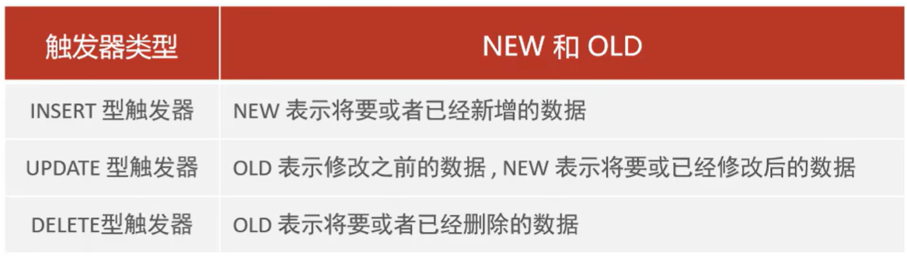

# 触发器
触发器是与表有关的数据库对象，指在 INSERT/UPDATE/DELETE **之前或之后**，触发并执行触发器中定义的 SQL 语句集合。触发器的这种特性可以协助应用在数据库端**确保数据的完整性，日志记录，数据校验**等操作

使用别名 OLD 和 NEW 来引用触发器中发生变化的记录内容，这与其他数据库是相似的。现在的触发器还只支持**行级触发**，不支持**语句级触发**


## 触发器基本语法
- 创建触发器
```sql
CREATE TRIGGER 触发器名字
BEFORE/AFTER INSERT/UPDATE/DELETE   # 指定触发的时机（在增删改之前/之后触发）
ON 表名 FOR EACH ROW    # 行级触发器
BEGIN
    # 触发器内部的逻辑实现    
END;
```
- 查看触发器
```sql
SHOW TRIGGERS;
```
- 删除触发器
```sql
DROP TRIGGER [数据库名称.]触发器名称;   # 如果没有指定数据库名称，默认删除当前数据库的触发器
```

> #### 例子——数据变更日志
> 通过触发器记录 tb_user 表的数据变更日志，将变更日志插入到日志表 user_logs 中，包括增加/修改/删除
> ```sql
> # 插入数据的触发器
> CREATE TRIGGER tb_user_insert_trigger
> AFTER INSERT ON tb_user FOR EACH ROW
> BEGIN
>     INSERT INTO user_logs (id, operation, operate_time, operate_id, operate_params) VALUES
>     (NULL, 'insert', NOW(), NEW.id, CONCAT('name: ', NEW.name, ', profession: ', NEW.profession, ', age: ', NEW.age));
> END;
> 
> # 更新数据的触发器
> CREATE TRIGGER tb_user_update_trigger
> AFTER UPDATE ON tb_user FOR EACH ROW
> BEGIN
>     INSERT INTO user_logs (id, operation, operate_time, operate_id, operate_params) VALUES
>     (NULL, 'update', NOW(), NEW.id, 
>     CONCAT('更新之前的数据：name: ', OLD.name, ', profession: ', OLD.profession, ', age: ', OLD.age, 
>           ' 更新之后的数据：name: ', NEW.name, ', profession: ', NEW.profession, ', age: ', NEW.age));
> END;
> 
> # 删除数据的触发器
> CREATE TRIGGER tb_user_delete_trigger
> AFTER DELETE ON tb_user FOR EACH ROW
> BEGIN
>     INSERT INTO user_logs (id, operation, operate_time, operate_id, operate_params) VALUES
>     (NULL, 'delete', NOW(), OLD.id, CONCAT('删除之前的数据: ','name: ', OLD.name, ', profession: ', OLD.profession, ', age: ', OLD.age));
> END;
> 
> # 查看触发器
> SHOW TRIGGERS;
> 
> # 删除触发器
> DROP TRIGGER tb_user_insert_trigger;
> ```