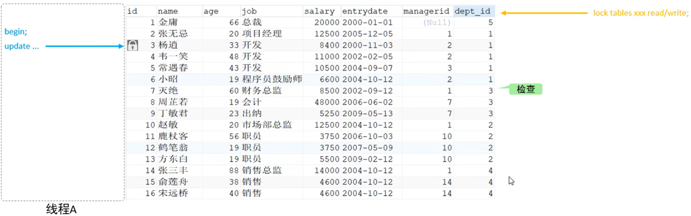

# 锁
锁是计算机**协调多个进程/线程并发访问某一资源**的机制。在数据库中，除传统的计算资源（CPU、RAM、I/O）的争用以外，**数据**也是一种供许多用户共享的资源。如何保证数据并发访问的**一致性、有效性**是所有数据库必须要解决的问题。**锁冲突**也是影响数据库并发访问性能的一个重要因素。从这个角度来说，锁对数据库而言显得尤其重要，也更加复杂

MySQL 中的锁，按照锁的粒度分，分为以下三类：
1. 全局锁：锁定数据库中的**所有表**
2. 表级锁：每次操作锁住**一张表**
3. 行级锁：每次操作锁住对应的**行数据**

## 全局锁
全局锁就是对整个数据库实例加锁，加锁后整个实例就处于**只读状态**，后续的 DML 的写语句、DDL 语句、已经更新操作的事务提交语句都将被阻塞

典型应用场景：**全库的逻辑备份**，对所有的表进行锁定，从而获取一致性视图，保证数据的完整性

### 语法
以数据备份为例，说明数据备份的整个流程是怎么样的
- 加锁
```sql
FLUSH TABLES WITH READ LOCK;
```
- 数据备份
```sql
# 该过程在 Windows 的命令行中执行
# -u 和 -p 后面不要加空格
MYSQLDUMP -u用户名 -p密码 数据库名称 > 保存数据的 SQL 文件名
```
- 解锁
```sql
UNLOCK TABLES;
```

### 缺点
1. 如果在主库上备份，那么在备份期间都不能执行更新，**业务基本就会停摆**
2. 如果在从库上备份，那么在备份期间从库不能执行主库同步过来的二进制日志（binlog），会导致**主从延迟**

在 InnoDB 引擎中，为了解决这个问题，我们可以在备份时加上参数 --single-transaction 参数来完成**不加锁**的一致性数据备份。语法如下：
```sql
mysqldump --single-transaction -u用户名 -p密码 数据库名称 > 保存数据的 SQL 文件名
```

## 表级锁
表级锁，每次操作锁住**整张表**。锁定粒度**大**，发生锁冲突的概率**最高**，并发度**最低**。应用在 MyISAM、InnoDB、BDB 等存储引擎中。
对于表级锁，主要分为以下 3 类：
- 表锁
- 元数据锁（meta data lock，MDL）
- 意向锁

### 表锁
表锁可以分为两类
- 表共享读锁（读锁）
- 表独占写锁（写锁）

语法如下：
- 加锁
```sql
LOCK TABLES 表名1, 表名2,... READ/WRITE;
```
- 释放锁
```sql
UNLOCK TABLES;
```

> #### Tips——释放锁的另一种方法
> 客户端断开连接也可以释放锁

#### 读锁
加了**读锁**之后，该客户端**只能读不能写**，而且读锁不会阻塞其他客户端的读，但是可以阻塞其他客户端的写
- 对于加锁的客户端，如果客户端写数据，则会**报错**
- 对于其他客户端，如果客户端写数据，则会**被阻塞**

当读锁释放时，被阻塞的写数据操作会**立刻执行**


#### 写锁
加了**写锁**之后，该客户端**既能读又能写**，但是写锁会阻塞其他客户端的读和写

同理，当写锁释放时，被阻塞的读写数据操作会**立刻执行**

### 元数据锁
> #### 问题——什么是元数据
> 元数据（MetaData）是指描述数据的数据。它提供了关于数据的结构、内容、上下文等信息，使得数据更容易理解、管理和使用。在数据库中，元数据包括**数据库名、表名、列名、用户名、版本名**等信息

元数据锁加锁过程是**系统自动控制**，不需显式使用，在访问一张表的时候会自动加上。元数据锁主要作用是**维护表元数据的数据一致性**，在表上有活动事务时，不可以对元数据进行**写入操作**（如果某一张表存在未提交的事务，那么我们不能修改这张表的表结构）。这样做可以**避免 DML 和 DDL 语句冲突，保证读写的正确性**


> #### Tips
> SHARED 类型的锁表示这些锁是可以共同存在的，EXCLUSIVE 类型的锁表示这个锁与其他**所有锁**互斥
> 例如现在有一把 SHARED 类型的锁，那么就不能有 EXCLUSIVE 类型的锁，即 alter table 操作**会被阻塞**

查看元数据锁的语法
```sql
SELECT object_type, object_schema, object_name, lock_type, lock_duration FROM performance_schema.metadata_locks;
```

### 意向锁
首先考虑这样一种情况：


线程 A 执行了一条 UPDATE 语句，给某一行上了一个行锁。线程 B 现在想要给整个表加上一个表锁。如果 B 直接加锁，那么**表锁和行锁就会冲突**，因此 B 在加表锁之前先要遍历该表的每一行，观察其是否加上了行锁。该过程的效率**较低**，因此我们提出了一种解决方法——**意向锁**

意向锁的存在使得表锁**不用检查每行数据是否加锁**，此时表锁只用查看**意向锁是否被加上**。如果意向锁被加上了，那么表锁的添加就会被**阻塞**，直到意向锁释放

一共有两类意向锁
- 意向共享锁（IS）：由语句 select ... lock in share mode 添加
- 意向排他锁（IX）：由语句 insert、update、delete、select ... for update 添加

这两种锁的兼容性如下：
- 意向共享锁（IS）：与**读锁**兼容，与**写锁**互斥
- 意向排他锁（IX）：与**读锁，写锁**互斥。意向锁之间**不会互斥**

查看意向锁的加锁情况语法
```sql
SELECT object_schema, object_name, index_name, lock_type, lock_mode, lock_data FROM performance_schema.data_locks;
```

## 行级锁
行级锁，每次操作锁住对应的行数据。锁定粒度**最小**，发生锁冲突的概率**最低**，并发度**最高**。应用在 InnoDB 存储引擎中
而 InnoDB 的数据是基于索引组织的，行锁是通过对索引上的**索引项加锁**来实现的，而不是对记录加的锁。对于行级锁，主要分为以下 3 类：
1. 行锁（Record Lock）：**锁定单个行记录**的锁，防止其他事务对此行进行 **update 和 delete**。在 RC、RR 隔离级别下都支持
2. 间隙锁（Gap Lock）：**锁定索引记录间隙**（不包含记录），确保索引记录间隙不变，防止其他事务在这个间隙进行 **INSERT**，产生幻读。在 RR 隔离级别下支持
3. 临键锁（Next-Key Lock）：行锁和间隙锁的组合，**锁住数据的同时锁住数据前面的间隙 Gap**。在 RR 隔离级别下支持

> #### 例子——行锁、间隙锁、临键锁
> 行锁
> 
>
> 间隙锁
> 
>
> 临键锁
> 

### 行锁
InnoDB 实现了以下两种类型的行锁
1. 共享锁（S）：允许一个事务去读一行，阻止其他事务获得相同数据集的排他锁
2. 排他锁（X）：允许获取排他锁的事务更新数据，阻止其他事务获得相同数据集的共享锁和排他锁

即：共享锁和共享锁之间**兼容**，共享锁和排他锁之间**互斥**，排他锁和排他锁之间**互斥**

常见操作添加的行锁类型如下：


默认情况下，InnoDB 在 RR 事务隔离级别运行，InnoDB 使用**临键锁**进行搜索和索引扫描，以防止**幻读**
- 针对**唯一索引**进行检索时，对已存在的记录进行**等值匹配**时，将会自动优化为**行锁**
- InnoDB 的行锁是针对于索引加的锁，**不通过索引条件检索数据**，那么 InnoDB 将对表中的所有记录加锁，此时就会升级为**表锁**

查看行锁的加锁情况语法
```sql
SELECT object_schema, object_name, index_name, lock_type, lock_mode, lock_data FROM performance_schema.data_locks;
```

### 间隙锁/临键锁
1. 索引上的等值查询（唯一索引），给**不存在的记录**加锁时，优化为**间隙锁**
2. 索引上的等值查询（普通索引），向右遍历时最后一个值不满足查询要求时，临键锁退化为**间隙锁**
3. 索引上的范围查询（唯一索引），会访问到不满足条件的第一个值为止

> #### Tips
> 间隙锁的唯一目的是**防止其他事务插入间隙**。间隙锁可以共存，一个事务采用的间隙锁**不会阻止**另一个事务在同一间隙上采用间隙锁