# InnoDB 引擎
## 逻辑存储结构
InnoDB 的逻辑存储结构如下图所示：
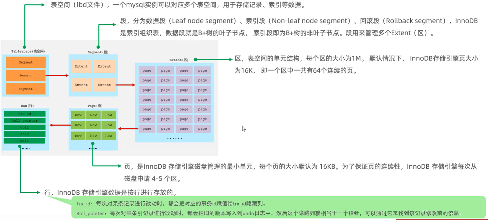

## 架构
InnoDB 的架构图如下图所示：
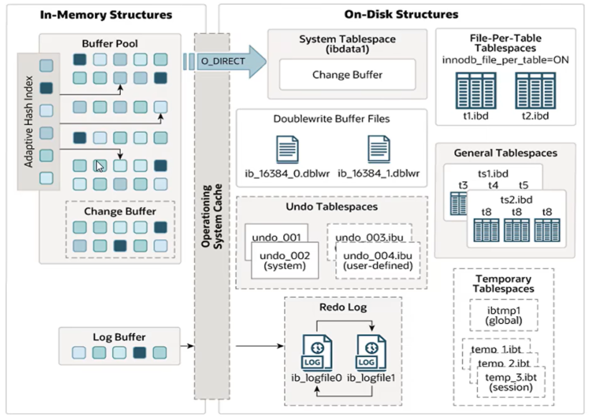

左侧是**内存结构**，右侧是**磁盘结构**
### 内存结构
内存结构分为了 4 个部分：
- Buffer Pool（缓冲池）
- Change Buffer（更改缓冲区）
- Log Buffer
- Adaptive Hash Index

#### Buffer Pool（缓冲池）
缓冲池是主内存中的一个区域，里面可以**缓存**磁盘上经常操作的真实数据，在执行增查删改操作时
- 如果缓冲池中有对应的数据页，则先操作缓冲池中的数据
- 如果缓冲池中没有对应的数据页，则会去磁盘中查找，磁盘中如果找到了对应的数据，则会把该页的数据直接 **copy 一份到缓冲池中并返回给客户端**

除此之外，缓冲池中的数据会以一定频率**刷新到磁盘**，从而**减少磁盘 I/O，加快处理速度**

> #### Tips
> 可以发现，Buffer Pool 和 Cache 比较类似

当然，缓冲池以 Page 页为单位，底层采用**链表数据结构**管理 Page。根据状态，将 Page 分为 3 种类型：
- free page：空闲 page，没有被使用
- clean page：被使用 page，但是数据**没有被修改过**
- dirty page：被使用 page，数据被修改过，池中数据与磁盘产生了**不一致**

#### Change Buffer（更改缓冲区）
Change Buffer 针对于**非唯一二级索引页**（也就是说主键索引/唯一索引是不会操作更改缓冲区的）
在执行 DML 语句（增删改）时，如果这些数据页**没有在 Buffer Pool 中**，**则不会直接操作磁盘**，而会将**数据变更**保存在**更改缓冲区**中。在未来数据被读取时，再将数据合并恢复到 Buffer Pool 中，然后再将**合并后的数据**刷新到磁盘中

> #### 问题——Change Buffer 的意义是什么
> 与聚集索引不同，二级索引通常是**非唯一的**，并且以**相对随机的**顺序插入二级索引。同样，删除和更新可能会影响索引数树中不相邻的二级索引页。如果每一次都操作磁盘，则会造成大量的**随机磁盘 I/O**。有了 Change Buffer 之后，我们可以在缓冲池中进行合并处理，减少磁盘 I/O
>
> 对于主键索引，通常是**顺序插入的**，所以磁盘 I/O 也是顺序的。

#### Adaptive Hash Index（自适应哈希索引）
Adaptive Hash Index 用于优化对 Buffer Pool 数据的查询。InnoDB 会监控对表上各索引页的查询，如果观察到 **Hash 索引可以提升速度**，则建立 Hash 索引，故称为自适应 Hash 索引

> #### Tips
> Adaptive Hash Index 无需人工干预，是系统根据情况自动完成

参数：innodb_adaptive_hash_index（如果为 ON 则说明自适应哈希索引已开启），查询语句如下：
```sql
SHOW VARIABLES LIKE '%hash_index%';
```

#### Log Buffer（日志缓冲区）
Log Buffer 用来保存要写入到磁盘中的 log 日志数据（redo log，undo log），默认大小为 **16 MB**，Log Buffer 的日志会定期刷新到磁盘中。如果需要更新、插入、删除**许多行的事务**，增加 Log Buffer 的大小可以节省磁盘 I/O

相关参数有 2 个
- innodb_log_buffer_size：缓冲区大小
- innodb_flush_log_at_trx_commit：日志刷新到磁盘的时机
  - 0：每秒将日志写入并刷新到磁盘一次
  - 1：日志在每次事务提交时写入并刷新到磁盘
  - 2：日志在每次事务提交后写入，写入后存入 OS Cache 里面，并每秒刷新到磁盘一次

### 磁盘结构
磁盘结构分为以下几个部分：

#### System Tablespace（系统表空间）
System Tablespace 是更改缓冲区的存储区域。如果表是**在系统表空间**而不是每个表文件或通用表空间中**创建**的，它也可能包含**表和索引数据**
参数：innodb_data_file_path
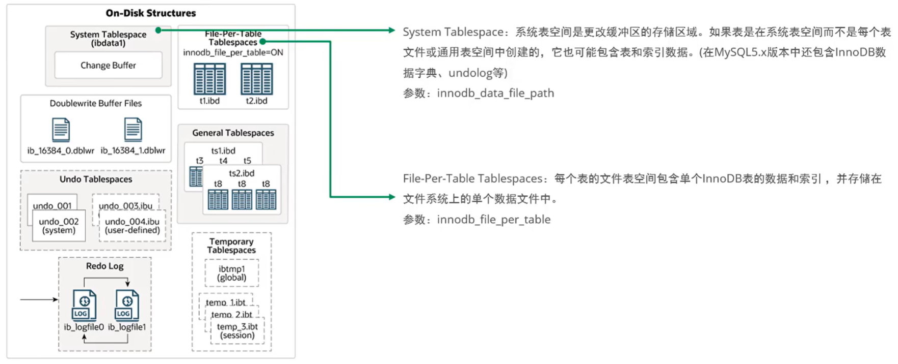

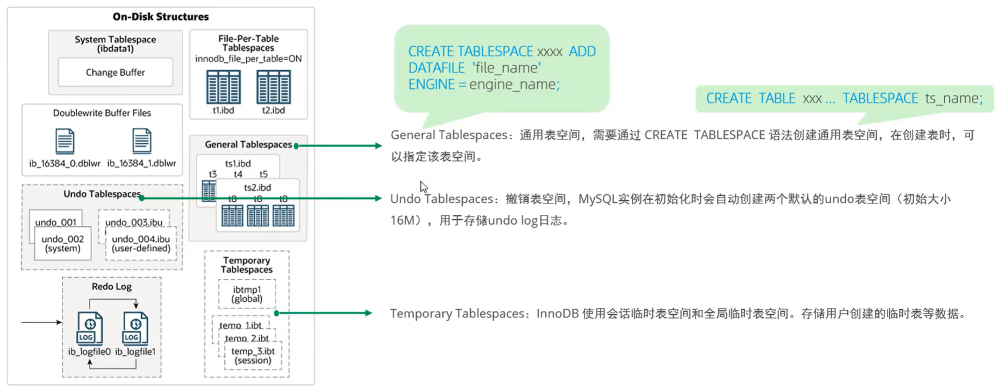

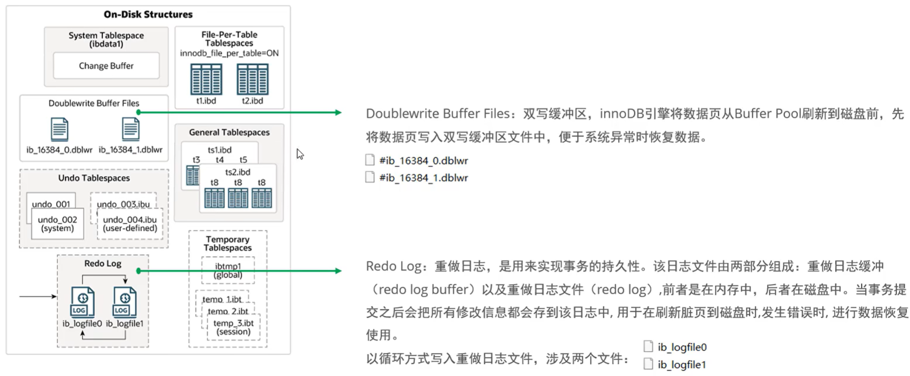

### 后台线程
#### Master Thread
核心后台线程，负责**调度其他线程**，还负责将缓冲池中的数据**异步刷新到磁盘中**，保证数据的一致性，还包括脏页的刷新、合并插入缓存、undo 页的回收

#### IO Thread
在 InnoDB 中大量使用了非阻塞异步 I/O 来处理 I/O 请求，这样可以极大提高数据库的性能，而 IO Thread 主要负责这些 IO 请求的回调
IO 线程的种类如下：
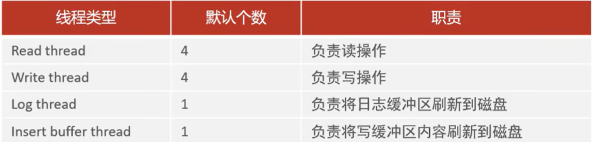

#### Purge Thread
主要用于回收**事务已经提交了的 undo log**。在事务提交之后，undo log 可能不用了，就用它来回收

#### Page Cleaner Thread
协助 Master Thread 刷新脏页到磁盘的线程，它可以减轻 Master Thread 的工作压力，减少阻塞

## 事务原理
本部分主要讲述事务的四大特性（原子性、一致性、隔离性、持久性）是如何实现的，其中：
- 原子性、一致性、持久性是由 **redo log 和 undo log** 实现的
- 隔离性是由**锁和 MVCC** 实现的

### redo log——持久性
redo log 记录的是事务提交时数据页的物理修改，是用来实现事务的**持久性**

redo log 由两部分组成：重做日志缓冲（redo log buffer）以及重做日志文件（redo log file），前者在**内存中**，后者在**磁盘中**。当事务提交之后会把所有修改信息都保存在 **redo log file** 中，用于**在刷新脏页到磁盘发生错误时**，进行**数据恢复**

> #### Tips——解释 '刷新脏页到磁盘发生错误'
> 考虑下面这个流程：其中深橘色的部分是**脏页**，脏页在刷新到磁盘的过程中可能会出错，此时磁盘中的数据还是**原来的数据**（即使用户已经提交了事务）。此时持久性就没有得到保障

现在考虑加入 redo log，如下图所示：
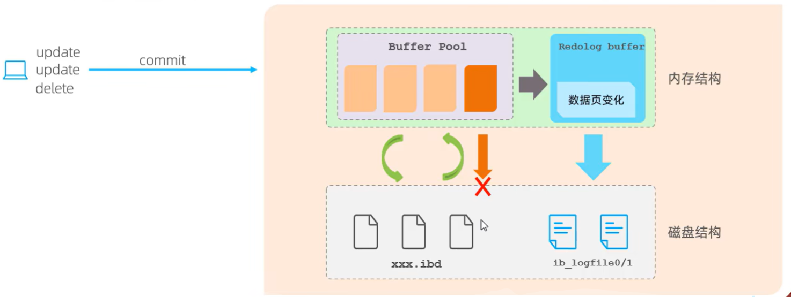

当我们对缓冲区的数据**进行增删改时**，它首先会把我们增删改的数据记录在 redo log Buffer 当中，即 redo log Buffer 中记录了数据页的**物理变化**。当**事务提交的时候**，它会把 redo log Buffer 中的数据页变化刷新到磁盘当中（redo log file）。接下来在进行脏页刷新的过程中，如果刷新发生了错误，此时可以通过 redo log file 进行恢复

> #### 问题——为什么不能在每次提交时直接提交 Buffer Pool 中的数据页
> **性能过差！！！**
> 我们在一个事务当中可能会操作多条记录，而这些记录都**随机地**操作数据页，这就会涉及大量的**随机磁盘 I/O**，性能较低！
>
> 而引入 redo log 后，由于磁盘中的是 log 日志文件，是追加的，即**顺序磁盘 I/O**

这一机制叫做 **WAL（Write-Ahead Logging）**

当脏页的数据顺利刷新到磁盘当中了，那么 redo log 日志里面记录的数据变更就不需要了，因此 redo log 日志会在一段时间后被清理

### undo log——原子性
undo log 用于记录数据**被修改前的信息**，作用包括两个：
- 提供回滚
- MVCC（多版本并发控制）

undo log 是**逻辑日志**（redo log 是**物理日志**）。可以认为当 delete 一条数据时，undo log 中会记录一条对应的 insert 记录。当 update 一条记录时，undo log 会记录一条对应相反的 update 记录。当执行 rollback 时，就可以从 undo log 中的逻辑记录中读取相应的内容并进行回滚

undo log 销毁：undo log 在事务执行时产生，事务提交时，**并不会立即删除 undo log**，因为这些日志还可能用于 MVCC

undo log 存储：undo log 采用段的方式进行管理和记录，存放在前面介绍的 rollback segment 回滚段中，内部包含 1024 个 undo log segment

## MVCC
### 一些基本概念
#### 当前读
读取的是记录的最新版本，读取时还要保证其他并发事务**不能修改当前记录**，会对读取的记录进行加锁。对于我们日常的操作，例如：
- SELECT ... LOCK IN SHARE MODE
- SELECT ... FOR UPDATE
- UPDATE
- INSERT
- DELETE

都是一种当前读

> #### 例子——什么是当前读
> 现在有 2 个会话（A，B）
> A 开启了一个事务，读取了 id = 1 的数据
> B 开启了一个事务，修改了 id = 1 的数据，并提交了事务
> 此时 A 用普通的 SELECT 语句，读到的是**修改前的事务**，因为此时的隔离级别是 RR
> 为了让 A 读到最新的数据，则需要使用 SELECT ... LOCK IN SHARE MODE，这一过程称为**当前读**

#### 快照读
简单的 SELECT（不加锁）就是快照读。快照读，读取的是记录数据的**可见版本**，有可能是**历史数据**，不加锁，是非阻塞读
- Read Committed：每次 SELECT，都会生成一个快照读
- RR 隔离级别：开启事务后的**第一个 SELECT 语句是快照读**（后面的 SELECT 语句查询的都是第一个 SELECT 产生的快照数据）
- Serializable：快照读退化为**当前读**

#### MVCC 基本概念
MVCC（Multi-Version Concurrency Control，多版本并发控制）指维护一个数据的多个版本，使得**读写操作没有冲突**，快照读为 MySQL 实现 MVCC 提供了一个非阻塞读功能。MVCC 的具体实现，还需要依赖于数据库记录中的**三个隐式字段、undo log 日志、readView**

### MVCC 实现原理
#### 隐藏字段
三个隐藏字段如下：
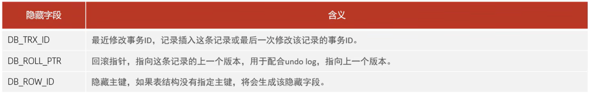

因此如果表中已经有主键了，那么 DB_ROW_ID 不会生成

#### undo log
回滚日志，在 INSERT、UPDATE、DELETE 的时候产生的便于数据回滚的日志
当 INSERT 的时候，产生的 undo log 日志只在回滚时需要，在事务提交后，**可被立即删除**
而 UPDATE、DELETE 的时候，产生的 undo log 日志不仅在回滚时需要，在快照读时也需要，**不会被立即删除**

#### undo log 版本链
不同事务或相同事务对同一条记录进行修改，会导致该记录的 undolog 生成一条记录版本链表
- 链表的**头部**是**最新**的旧记录
- 链表的**尾部**是**最早**的旧记录

> #### 例子——undo log 版本链
> 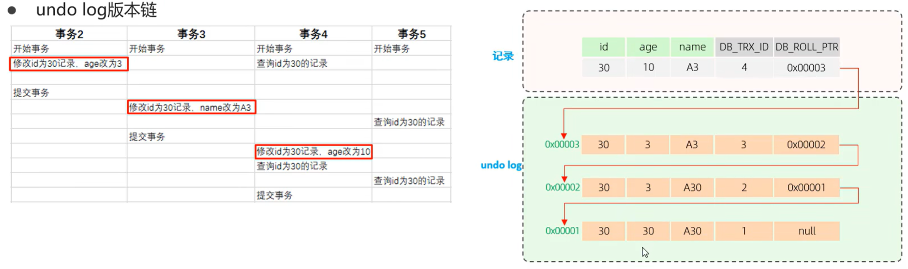
>
> trx_id = 1 的事务是：插入一条数据
> trx_id = 2 的事务是：将 age 修改为 3
> trx_id = 3 的事务是：将 name 修改为 A3
> trx_id = 4 的事务是：将 age 修改为 10

> #### Tips
> 快照读读取哪一个历史记录**不是由版本链决定的，而是由下面的 ReadView 决定的**

#### ReadView
ReadView 是**快照读** SQL 执行时 MVCC 提取数据的依据，记录的是本事务执行时，MySQL还有哪些事务在执行，且还没有提交。(当前系统中还有哪些活跃的读写事务)
ReadView 包含了下面 4 个核心字段
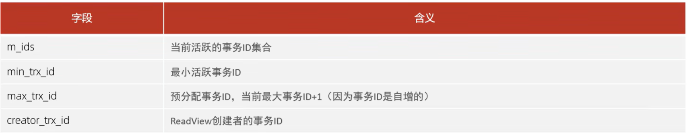

前三个字段的关系如下：
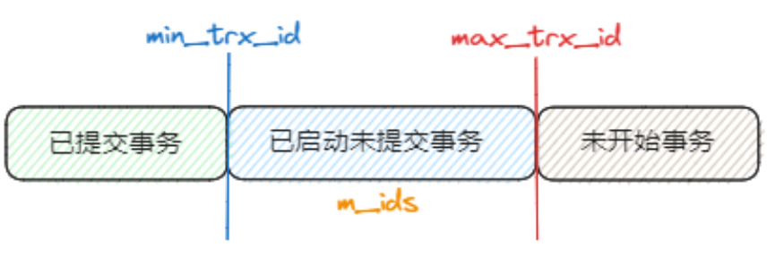

版本链数据访问规则如下：
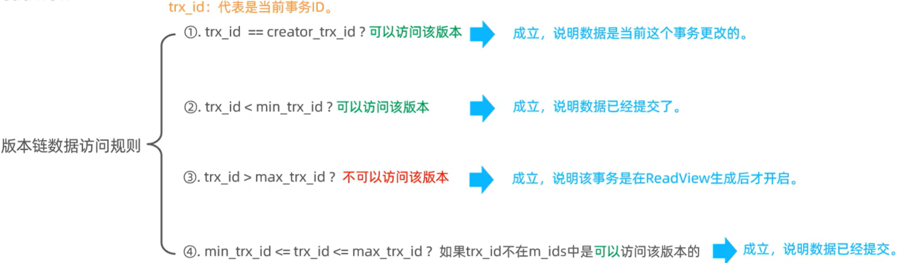

> #### Tips
> 不同的隔离级别，生成 ReadView 的时机不同
> RC：在事务中**每一次执行快照读时**生成 ReadView
> RR：在事务中**第一次执行快照读时**生成 ReadView，后续复用该 ReadView

> #### 例子—— RC 下的 ReadView
> 首先考虑事务 5 的第一个 SELECT 操作：
> 
>
> 此时记录中的 trx_id = 4，可以发现这条记录不满足给出的 4 条规则，因此**根据回滚指针找到下一条记录**，即 trx_id = 3 的记录。可以发现这条记录也不满足给出的 4 条规则，因此**根据回滚指针找到下一条记录**，即 trx_id = 2 的记录。可以发现这条记录满足规则 2：trx_id < min_trx_id（实际上，事务 2 已经提交了）。因此事务 5 的第一个 SELECT 语句读出的是 trx_id = 2 的数据

> #### 例子——RR 下的 ReadView
> 如下图所示：
> 